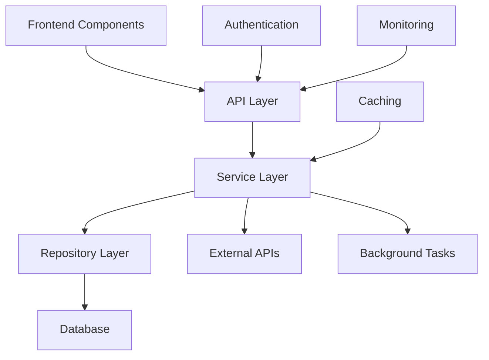
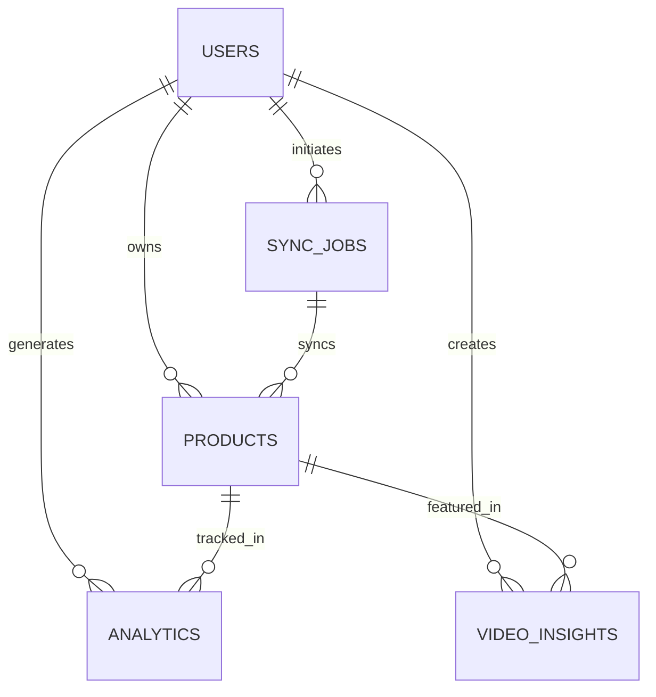
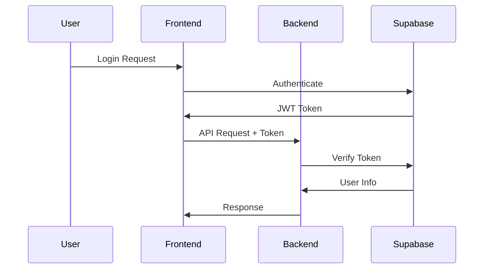
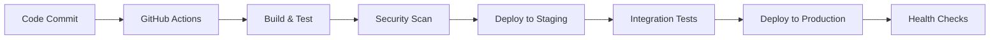

# Architecture Overview

This document provides a comprehensive overview of the Retail AI Advisor application architecture, including system design, technology stack, and deployment considerations.

## 📋 Table of Contents

1. [System Overview](#system-overview)
2. [Technology Stack](#technology-stack)
3. [Architecture Patterns](#architecture-patterns)
4. [Component Architecture](#component-architecture)
5. [Data Architecture](#data-architecture)
6. [Security Architecture](#security-architecture)
7. [Deployment Architecture](#deployment-architecture)
8. [Performance Considerations](#performance-considerations)
9. [Scalability Design](#scalability-design)
10. [Monitoring & Observability](#monitoring--observability)

## 🏗️ System Overview

### High-Level Architecture

The Retail AI Advisor follows a modern, cloud-native architecture with clear separation of concerns:

```
┌─────────────────┐    ┌─────────────────┐    ┌─────────────────┐
│   Frontend      │    │    Backend      │    │   External      │
│   (Next.js)     │◄──►│   (FastAPI)     │◄──►│   Services      │
│                 │    │                 │    │                 │
└─────────────────┘    └─────────────────┘    └─────────────────┘
         │                       │                       │
         │                       │                       │
         ▼                       ▼                       ▼
┌─────────────────┐    ┌─────────────────┐    ┌─────────────────┐
│   Azure Static  │    │   Azure App     │    │   Supabase      │
│   Web Apps      │    │   Service       │    │   Database      │
└─────────────────┘    └─────────────────┘    └─────────────────┘
```

### Core Principles

1. **Microservices Architecture**: Modular, loosely coupled services
2. **API-First Design**: RESTful APIs with comprehensive documentation
3. **Cloud-Native**: Built for Azure cloud platform
4. **Security by Design**: Authentication, authorization, and data protection
5. **Scalability**: Horizontal and vertical scaling capabilities
6. **Observability**: Comprehensive monitoring and logging

## 🛠️ Technology Stack

### Frontend Stack

| Component | Technology | Version | Purpose |
|-----------|------------|---------|---------|
| **Framework** | Next.js | 14.2.3 | React-based web framework |
| **Language** | TypeScript | 5.x | Type-safe JavaScript |
| **Styling** | Tailwind CSS | 3.4.1 | Utility-first CSS framework |
| **State Management** | React Context | Built-in | Application state management |
| **HTTP Client** | Axios | 1.9.0 | API communication |
| **Charts** | Chart.js + React-Chartjs-2 | 4.4.9 | Data visualization |
| **Forms** | React Hook Form | 7.56.4 | Form handling and validation |
| **Icons** | Lucide React | 0.511.0 | Icon library |
| **Build Tool** | Next.js | Built-in | Bundling and optimization |

### Backend Stack

| Component | Technology | Version | Purpose |
|-----------|------------|---------|---------|
| **Framework** | FastAPI | 0.104.1 | Python web framework |
| **Language** | Python | 3.11+ | Backend programming language |
| **ASGI Server** | Uvicorn | 0.24.0 | ASGI server for FastAPI |
| **Production Server** | Gunicorn | 21.2.0 | WSGI HTTP server |
| **ORM** | SQLAlchemy | 2.0.23 | Database ORM |
| **Database Driver** | AsyncPG | 0.29.0 | PostgreSQL async driver |
| **Migrations** | Alembic | 1.12.1 | Database migrations |
| **Authentication** | Python-JOSE | 3.3.0 | JWT token handling |
| **Password Hashing** | Passlib | 1.7.4 | Secure password hashing |
| **HTTP Client** | HTTPX | 0.25.2 | Async HTTP client |
| **Data Processing** | Pandas | 2.1.4 | Data manipulation |
| **Validation** | Pydantic | 2.5.0 | Data validation |

### Database & Storage

| Component | Technology | Purpose |
|-----------|------------|---------|
| **Primary Database** | PostgreSQL (Supabase) | Application data storage |
| **Authentication** | Supabase Auth | User authentication |
| **File Storage** | Azure Blob Storage | Media and file storage |
| **Caching** | Redis | Session and data caching |
| **Search** | PostgreSQL Full-Text | Product search functionality |

### External Services

| Service | Purpose | Integration |
|---------|---------|-------------|
| **Supabase** | Database and Auth | Direct integration |
| **Azure OpenAI** | AI/ML capabilities | API integration |
| **VEED.io** | Video processing | API integration |
| **Shopify** | E-commerce platform | REST API |
| **WooCommerce** | E-commerce platform | REST API |
| **Sentry** | Error monitoring | SDK integration |
| **Azure Key Vault** | Secrets management | Azure SDK |

## 🏛️ Architecture Patterns

### 1. Layered Architecture

The backend follows a layered architecture pattern:

```
┌─────────────────────────────────────┐
│           API Layer                 │  ← FastAPI routes and endpoints
├─────────────────────────────────────┤
│         Business Logic Layer        │  ← Service classes and business rules
├─────────────────────────────────────┤
│         Data Access Layer           │  ← Repository pattern and ORM
├─────────────────────────────────────┤
│         Database Layer              │  ← PostgreSQL database
└─────────────────────────────────────┘
```

### 2. Repository Pattern

Data access is abstracted through repository classes:

```python
# Abstract repository interface
class BaseRepository(ABC):
    @abstractmethod
    async def create(self, entity: BaseModel) -> BaseModel:
        pass
    
    @abstractmethod
    async def get_by_id(self, id: UUID) -> Optional[BaseModel]:
        pass

# Concrete implementation
class ProductRepository(BaseRepository):
    async def create(self, product: ProductCreate) -> Product:
        # Implementation details
        pass
```

### 3. Dependency Injection

FastAPI's dependency injection system is used throughout:

```python
# Dependencies
async def get_current_user(token: str = Depends(oauth2_scheme)) -> User:
    # Authentication logic
    pass

# Route with dependencies
@router.get("/products")
async def get_products(
    current_user: User = Depends(get_current_user),
    db: AsyncSession = Depends(get_db)
):
    # Route implementation
    pass
```

### 4. Event-Driven Architecture

Asynchronous processing for long-running tasks:

```python
# Background task processing
@celery_app.task
async def process_video_analysis(video_id: str):
    # Video processing logic
    pass

# Event publishing
async def publish_sync_event(user_id: str, platform: str):
    # Event publishing logic
    pass
```

## 🧩 Component Architecture

### Frontend Components

```
src/
├── app/                    # Next.js app directory
│   ├── auth/              # Authentication pages
│   ├── dashboard/         # Dashboard pages
│   └── layout.tsx         # Root layout
├── components/            # Reusable components
│   ├── ui/               # UI components
│   ├── charts/           # Chart components
│   └── forms/            # Form components
├── contexts/             # React contexts
├── lib/                  # Utility libraries
├── types/                # TypeScript types
└── styles/               # Global styles
```

### Backend Components

```
backend/
├── app/
│   ├── api/              # API routes
│   │   ├── v1/          # API version 1
│   │   └── middleware/   # Custom middleware
│   ├── core/            # Core functionality
│   │   ├── config.py    # Configuration
│   │   ├── database.py  # Database setup
│   │   └── security.py  # Security utilities
│   ├── models/          # Database models
│   ├── services/        # Business logic
│   └── utils/           # Utility functions
├── tests/               # Test files
└── main.py             # Application entry point
```

### Component Interaction



## 🗄️ Data Architecture

### Database Schema

#### Core Entities

1. **Users**
   - Authentication and profile data
   - Subscription information
   - Preferences and settings

2. **Products**
   - Product catalog data
   - Pricing and inventory
   - Platform synchronization

3. **Analytics**
   - Performance metrics
   - Time-series data
   - Aggregated statistics

4. **Video Insights**
   - Video metadata
   - Analysis results
   - AI-generated recommendations

5. **Sync Jobs**
   - Platform synchronization status
   - Error tracking
   - Performance metrics

#### Entity Relationships



### Data Flow

#### 1. Product Data Flow

```
Platform (Shopify/WooCommerce) 
    ↓ (API Sync)
Backend Service 
    ↓ (Validation & Processing)
Database 
    ↓ (Query)
Frontend Dashboard
```

#### 2. Analytics Data Flow

```
User Interactions 
    ↓ (Event Tracking)
Analytics Service 
    ↓ (Aggregation)
Time-Series Database 
    ↓ (Visualization)
Dashboard Charts
```

#### 3. Video Processing Flow

```
Video Upload 
    ↓ (File Storage)
Azure Blob Storage 
    ↓ (Processing Queue)
AI Analysis Service 
    ↓ (Results)
Insights Database 
    ↓ (Display)
Frontend Interface
```

## 🔒 Security Architecture

### Authentication & Authorization

#### 1. Authentication Flow



#### 2. Authorization Levels

| Role | Permissions | Access Level |
|------|-------------|--------------|
| **User** | Own data only | Read/Write own resources |
| **Admin** | Organization data | Manage organization |
| **Super Admin** | System-wide | Full system access |

### Security Measures

#### 1. Data Protection

- **Encryption in Transit**: TLS 1.3 for all communications
- **Encryption at Rest**: AES-256 for database and storage
- **Key Management**: Azure Key Vault for secrets
- **Data Masking**: Sensitive data protection in logs

#### 2. API Security

- **Rate Limiting**: Configurable per endpoint
- **Input Validation**: Pydantic models for all inputs
- **CORS Configuration**: Restricted origins
- **Security Headers**: OWASP recommended headers

#### 3. Infrastructure Security

- **Network Security**: VPC and security groups
- **Access Control**: IAM roles and policies
- **Monitoring**: Security event logging
- **Compliance**: SOC 2, GDPR compliance

## ☁️ Deployment Architecture

### Azure Infrastructure

```
┌─────────────────────────────────────────────────────────────┐
│                    Azure Subscription                       │
├─────────────────────────────────────────────────────────────┤
│  ┌─────────────────┐  ┌─────────────────┐  ┌─────────────────┐ │
│  │ Resource Group  │  │ Resource Group  │  │ Resource Group  │ │
│  │   (Frontend)    │  │   (Backend)     │  │   (Shared)      │ │
│  │                 │  │                 │  │                 │ │
│  │ Static Web Apps │  │ App Service     │  │ Key Vault       │ │
│  │ CDN             │  │ Container Reg   │  │ Storage Account │ │
│  └─────────────────┘  │ Redis Cache     │  │ Log Analytics   │ │
│                       └─────────────────┘  └─────────────────┘ │
└─────────────────────────────────────────────────────────────────┘
```

### Deployment Pipeline

#### 1. CI/CD Workflow



#### 2. Environment Strategy

| Environment | Purpose | Configuration |
|-------------|---------|---------------|
| **Development** | Local development | Docker Compose |
| **Staging** | Pre-production testing | Azure (scaled down) |
| **Production** | Live application | Azure (full scale) |

### Container Strategy

#### 1. Docker Configuration

```dockerfile
# Multi-stage build for optimization
FROM python:3.11-slim as builder
# Build dependencies

FROM python:3.11-slim as runtime
# Runtime configuration
COPY --from=builder /app /app
```

#### 2. Container Orchestration

- **Azure Container Instances**: For backend services
- **Azure Static Web Apps**: For frontend hosting
- **Azure Container Registry**: For image storage

## ⚡ Performance Considerations

### Frontend Optimization

#### 1. Code Splitting

```javascript
// Dynamic imports for route-based splitting
const Dashboard = dynamic(() => import('./Dashboard'), {
  loading: () => <Loading />
});
```

#### 2. Caching Strategy

- **Browser Caching**: Static assets with long TTL
- **CDN Caching**: Global content distribution
- **API Caching**: Response caching for static data

#### 3. Bundle Optimization

- **Tree Shaking**: Remove unused code
- **Minification**: Compress JavaScript and CSS
- **Image Optimization**: WebP format and lazy loading

### Backend Optimization

#### 1. Database Optimization

```sql
-- Optimized queries with proper indexing
CREATE INDEX CONCURRENTLY idx_products_user_category 
ON products(user_id, category) 
WHERE status = 'active';
```

#### 2. Caching Layers

```python
# Redis caching for expensive operations
@cache(expire=300)
async def get_product_analytics(product_id: str):
    # Expensive analytics calculation
    pass
```

#### 3. Async Processing

```python
# Background task processing
@celery_app.task
async def process_bulk_sync(user_id: str, platform: str):
    # Long-running sync operation
    pass
```

### Performance Metrics

| Metric | Target | Monitoring |
|--------|--------|------------|
| **API Response Time** | < 200ms (95th percentile) | Application Insights |
| **Frontend Load Time** | < 2s (First Contentful Paint) | Lighthouse CI |
| **Database Query Time** | < 100ms average | Query performance logs |
| **Uptime** | 99.9% | Health check monitoring |

## 📈 Scalability Design

### Horizontal Scaling

#### 1. Stateless Services

- **Backend Services**: No server-side session state
- **Load Balancing**: Azure Load Balancer
- **Auto Scaling**: Based on CPU and memory metrics

#### 2. Database Scaling

```sql
-- Read replicas for query distribution
-- Connection pooling for efficient resource usage
-- Partitioning for large tables
```

### Vertical Scaling

#### 1. Resource Optimization

- **Memory Management**: Efficient data structures
- **CPU Optimization**: Async processing
- **Storage Optimization**: Compressed data storage

#### 2. Scaling Triggers

| Metric | Threshold | Action |
|--------|-----------|--------|
| **CPU Usage** | > 70% for 5 minutes | Scale up instances |
| **Memory Usage** | > 80% | Increase memory allocation |
| **Response Time** | > 500ms average | Add more instances |
| **Queue Length** | > 100 items | Scale background workers |

### Microservices Scaling

```
┌─────────────────┐    ┌─────────────────┐    ┌─────────────────┐
│   API Gateway   │    │   Auth Service  │    │ Analytics Svc   │
│   (Load Bal.)   │◄──►│   (2 instances) │    │ (3 instances)   │
└─────────────────┘    └─────────────────┘    └─────────────────┘
         │                       │                       │
         ▼                       ▼                       ▼
┌─────────────────┐    ┌─────────────────┐    ┌─────────────────┐
│  Product Svc    │    │   Sync Service  │    │  Video Service  │
│  (4 instances)  │    │   (2 instances) │    │  (1 instance)   │
└─────────────────┘    └─────────────────┘    └─────────────────┘
```

## 📊 Monitoring & Observability

### Logging Strategy

#### 1. Structured Logging

```python
import structlog

logger = structlog.get_logger()

# Structured log entry
logger.info(
    "Product created",
    user_id=user.id,
    product_id=product.id,
    category=product.category,
    price=product.price
)
```

#### 2. Log Levels

| Level | Usage | Examples |
|-------|-------|----------|
| **DEBUG** | Development debugging | Variable values, flow control |
| **INFO** | General information | User actions, system events |
| **WARNING** | Potential issues | Deprecated API usage, retries |
| **ERROR** | Error conditions | Failed operations, exceptions |
| **CRITICAL** | System failures | Service unavailable, data corruption |

### Metrics Collection

#### 1. Application Metrics

```python
# Custom metrics with Prometheus
from prometheus_client import Counter, Histogram

request_count = Counter('http_requests_total', 'Total HTTP requests')
request_duration = Histogram('http_request_duration_seconds', 'HTTP request duration')
```

#### 2. Business Metrics

- **User Engagement**: Active users, session duration
- **Product Performance**: Views, conversions, revenue
- **System Health**: Error rates, response times
- **Resource Usage**: CPU, memory, storage

### Alerting

#### 1. Alert Categories

| Category | Severity | Response Time |
|----------|----------|---------------|
| **Critical** | System down | Immediate |
| **High** | Performance degradation | 15 minutes |
| **Medium** | Resource warnings | 1 hour |
| **Low** | Informational | 24 hours |

#### 2. Alert Channels

- **PagerDuty**: Critical alerts
- **Slack**: Team notifications
- **Email**: Summary reports
- **SMS**: Emergency contacts

### Observability Tools

| Tool | Purpose | Integration |
|------|---------|-------------|
| **Application Insights** | APM and monitoring | Azure native |
| **Sentry** | Error tracking | SDK integration |
| **Prometheus** | Metrics collection | Custom metrics |
| **Grafana** | Visualization | Dashboard creation |
| **Azure Monitor** | Infrastructure monitoring | Azure services |

---

## 🔄 Continuous Improvement

### Architecture Evolution

1. **Regular Reviews**: Quarterly architecture assessments
2. **Performance Optimization**: Continuous monitoring and tuning
3. **Technology Updates**: Regular dependency updates
4. **Security Audits**: Annual security assessments
5. **Scalability Planning**: Proactive capacity planning

### Future Considerations

1. **Microservices Migration**: Gradual service extraction
2. **Event Sourcing**: For audit trails and replay capability
3. **CQRS Implementation**: Command Query Responsibility Segregation
4. **Machine Learning Pipeline**: Enhanced AI capabilities
5. **Multi-Region Deployment**: Global availability

This architecture provides a solid foundation for the Retail AI Advisor platform while maintaining flexibility for future growth and evolution.