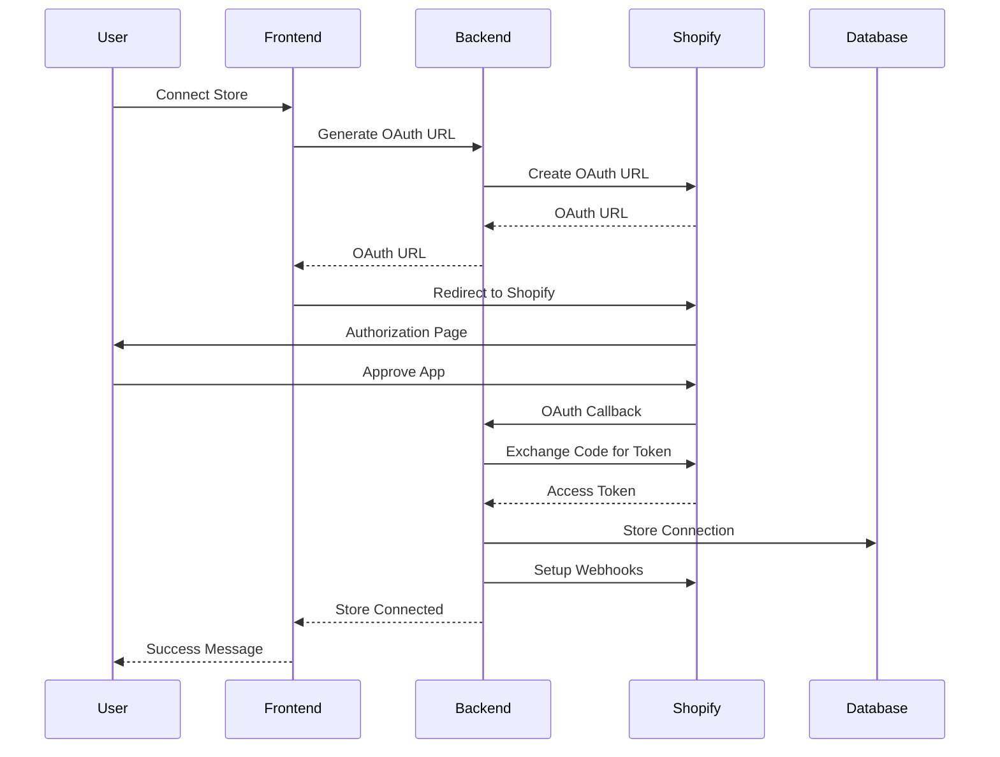

# Shopify Integration Developer Guide

This guide provides technical documentation for developers working on or extending the Shopify integration in the Retail AI Advisor platform.

## Table of Contents

1. [Architecture Overview](#architecture-overview)
2. [Code Structure](#code-structure)
3. [Design Patterns](#design-patterns)
4. [API Design](#api-design)
5. [Database Design](#database-design)
6. [Security Implementation](#security-implementation)
7. [Testing Strategy](#testing-strategy)
8. [Performance Optimization](#performance-optimization)
9. [Extending the Integration](#extending-the-integration)
10. [Contribution Guidelines](#contribution-guidelines)

## Architecture Overview

### System Architecture

The Shopify integration follows a layered architecture pattern:

```
┌─────────────────────────────────────────────────────────────┐
│                    Frontend Layer                           │
│  ┌─────────────────┐  ┌─────────────────┐  ┌──────────────┐ │
│  │ Store Connection│  │ Store Dashboard │  │ Sync Progress│ │
│  │    Component    │  │   Component     │  │  Component   │ │
│  └─────────────────┘  └─────────────────┘  └──────────────┘ │
└─────────────────────────────────────────────────────────────┘
                                │
                                ▼
┌─────────────────────────────────────────────────────────────┐
│                     API Layer                               │
│  ┌─────────────────┐  ┌─────────────────┐  ┌──────────────┐ │
│  │ OAuth Endpoints │  │ Store Endpoints │  │   Webhook    │ │
│  │                 │  │                 │  │  Endpoints   │ │
│  └─────────────────┘  └─────────────────┘  └──────────────┘ │
└─────────────────────────────────────────────────────────────┘
                                │
                                ▼
┌─────────────────────────────────────────────────────────────┐
│                   Service Layer                             │
│  ┌─────────────────┐  ┌─────────────────┐  ┌──────────────┐ │
│  │ Shopify Service │  │ API Client      │  │ Rate Limiter │ │
│  │                 │  │                 │  │              │ │
│  └─────────────────┘  └─────────────────┘  └──────────────┘ │
└─────────────────────────────────────────────────────────────┘
                                │
                                ▼
┌─────────────────────────────────────────────────────────────┐
│                    Data Layer                               │
│  ┌─────────────────┐  ┌─────────────────┐  ┌──────────────┐ │
│  │ Shopify Models  │  │ Database Schema │  │ Migrations   │ │
│  │                 │  │                 │  │              │ │
│  └─────────────────┘  └─────────────────┘  └──────────────┘ │
└─────────────────────────────────────────────────────────────┘
```

### Integration Flow



## Code Structure

### Backend Structure

```
backend/
├── app/
│   ├── api/v1/
│   │   └── shopify.py              # Shopify API endpoints
│   ├── models/
│   │   └── shopify.py              # Pydantic models
│   ├── services/
│   │   └── shopify_service.py      # Business logic
│   └── core/
│       ├── database.py             # Database connection
│       └── logging.py              # Logging utilities
├── migrations/
│   ├── create_shopify_tables.sql   # SQL migration
│   └── create_shopify_tables.py    # Python migration
└── tests/
    ├── test_shopify_service.py     # Service tests
    └── test_shopify_api.py         # API tests
```

### Frontend Structure

```
frontend/src/
├── components/shopify/
│   ├── ShopifyStoreConnection.tsx  # Store connection UI
│   ├── ShopifyStoreDashboard.tsx   # Store management UI
│   ├── ShopifyOAuthCallback.tsx    # OAuth callback handler
│   └── ShopifySyncProgress.tsx     # Sync progress UI
├── pages/dashboard/shopify/
│   ├── page.tsx                    # Main Shopify page
│   └── callback/page.tsx           # OAuth callback page
├── lib/
│   └── api.ts                      # API client functions
└── types/
    └── index.ts                    # TypeScript type definitions
```

## Design Patterns

### 1. Service Layer Pattern

The integration uses a service layer to encapsulate business logic:

```python
class ShopifyService:
    """Main service class for Shopify operations."""
    
    def __init__(self, db_client, api_client_factory):
        self.db = db_client
        self.api_client_factory = api_client_factory
    
    async def exchange_oauth_code(self, shop_domain: str, code: str, user_id: str):
        """Exchange OAuth code for access token."""
        # Business logic here
        pass
    
    async def sync_products(self, shop_id: int, full_sync: bool = False):
        """Synchronize products from Shopify."""
        # Business logic here
        pass
```

### 2. Factory Pattern

API client creation uses the factory pattern:

```python
class ShopifyApiClientFactory:
    """Factory for creating Shopify API clients."""
    
    @staticmethod
    def create_client(shop_domain: str, access_token: str) -> ShopifyApiClient:
        return ShopifyApiClient(
            shop_domain=shop_domain,
            access_token=access_token,
            rate_limiter=ShopifyRateLimiter()
        )
```

### 3. Strategy Pattern

Different sync strategies are implemented using the strategy pattern:

```python
class SyncStrategy(ABC):
    """Abstract base class for sync strategies."""
    
    @abstractmethod
    async def sync(self, client: ShopifyApiClient, shop_id: int) -> SyncResult:
        pass

class FullSyncStrategy(SyncStrategy):
    """Full synchronization strategy."""
    
    async def sync(self, client: ShopifyApiClient, shop_id: int) -> SyncResult:
        # Full sync implementation
        pass

class IncrementalSyncStrategy(SyncStrategy):
    """Incremental synchronization strategy."""
    
    async def sync(self, client: ShopifyApiClient, shop_id: int) -> SyncResult:
        # Incremental sync implementation
        pass
```

### 4. Observer Pattern

Webhook processing uses the observer pattern:

```python
class WebhookEventHandler:
    """Handles webhook events."""
    
    def __init__(self):
        self.handlers = {}
    
    def register_handler(self, event_type: str, handler: Callable):
        """Register a handler for an event type."""
        if event_type not in self.handlers:
            self.handlers[event_type] = []
        self.handlers[event_type].append(handler)
    
    async def handle_event(self, event_type: str, event_data: dict):
        """Handle a webhook event."""
        if event_type in self.handlers:
            for handler in self.handlers[event_type]:
                await handler(event_data)
```

## API Design

### RESTful Design Principles

The Shopify API follows RESTful design principles:

1. **Resource-based URLs**: `/api/v1/shopify/stores/{shop_id}`
2. **HTTP Methods**: GET, POST, PUT, DELETE for different operations
3. **Status Codes**: Appropriate HTTP status codes for responses
4. **Consistent Response Format**: Standardized JSON responses

### Request/Response Patterns

#### Standard Response Format

```python
class APIResponse(BaseModel):
    """Standard API response format."""
    
    data: Optional[Any] = None
    message: Optional[str] = None
    errors: Optional[List[str]] = None
    meta: Optional[Dict[str, Any]] = None
```

#### Error Handling

```python
class ShopifyAPIError(HTTPException):
    """Custom exception for Shopify API errors."""
    
    def __init__(self, status_code: int, detail: str, error_code: str = None):
        super().__init__(status_code=status_code, detail=detail)
        self.error_code = error_code
```

### Pagination

Large datasets use cursor-based pagination:

```python
class PaginatedResponse(BaseModel):
    """Paginated response format."""
    
    data: List[Any]
    pagination: Dict[str, Any] = {
        "has_next": False,
        "has_previous": False,
        "next_cursor": None,
        "previous_cursor": None,
        "total_count": None
    }
```

## Database Design

### Schema Design Principles

1. **Normalization**: Proper normalization to reduce redundancy
2. **Foreign Keys**: Maintain referential integrity
3. **Indexing**: Strategic indexing for performance
4. **Row Level Security**: User-based data access control

### Key Tables

#### shopify_stores
```sql
CREATE TABLE shopify_stores (
    id SERIAL PRIMARY KEY,
    user_id UUID NOT NULL REFERENCES auth.users(id),
    shop_domain VARCHAR(255) NOT NULL UNIQUE,
    shop_name VARCHAR(255) NOT NULL,
    access_token TEXT NOT NULL,
    scope TEXT NOT NULL,
    is_active BOOLEAN DEFAULT TRUE,
    shop_config JSONB DEFAULT '{}',
    last_sync_at TIMESTAMP WITH TIME ZONE,
    created_at TIMESTAMP WITH TIME ZONE DEFAULT NOW(),
    updated_at TIMESTAMP WITH TIME ZONE DEFAULT NOW()
);
```

#### shopify_products
```sql
CREATE TABLE shopify_products (
    id SERIAL PRIMARY KEY,
    shop_id INTEGER NOT NULL REFERENCES shopify_stores(id),
    sku_id INTEGER NOT NULL REFERENCES products(sku_id),
    shopify_product_id BIGINT NOT NULL,
    shopify_variant_id BIGINT,
    handle VARCHAR(255) NOT NULL,
    product_type VARCHAR(255),
    vendor VARCHAR(255),
    tags TEXT,
    published_at TIMESTAMP WITH TIME ZONE,
    shopify_created_at TIMESTAMP WITH TIME ZONE,
    shopify_updated_at TIMESTAMP WITH TIME ZONE,
    created_at TIMESTAMP WITH TIME ZONE DEFAULT NOW(),
    updated_at TIMESTAMP WITH TIME ZONE DEFAULT NOW(),
    UNIQUE(shop_id, shopify_product_id, shopify_variant_id)
);
```

### Migration Strategy

Migrations are versioned and reversible:

```python
class ShopifyMigration:
    """Shopify database migration."""
    
    version = "001"
    description = "Create Shopify integration tables"
    
    def up(self, connection):
        """Apply migration."""
        with open('create_shopify_tables.sql', 'r') as f:
            connection.execute(f.read())
    
    def down(self, connection):
        """Reverse migration."""
        tables = [
            'shopify_sync_jobs',
            'shopify_webhook_events',
            'shopify_orders',
            'shopify_products',
            'shopify_stores'
        ]
        for table in tables:
            connection.execute(f"DROP TABLE IF EXISTS {table} CASCADE")
```

## Security Implementation

### Authentication and Authorization

1. **JWT Tokens**: User authentication via JWT
2. **Row Level Security**: Database-level access control
3. **API Key Validation**: Shopify API key verification
4. **Webhook Verification**: HMAC signature validation

### Webhook Security

```python
def verify_webhook_signature(payload: bytes, signature: str, secret: str) -> bool:
    """Verify Shopify webhook signature."""
    import hmac
    import hashlib
    import base64
    
    computed_signature = base64.b64encode(
        hmac.new(
            secret.encode('utf-8'),
            payload,
            hashlib.sha256
        ).digest()
    ).decode('utf-8')
    
    return hmac.compare_digest(computed_signature, signature)
```

### Data Encryption

```python
class TokenEncryption:
    """Encrypt/decrypt access tokens."""
    
    def __init__(self, key: str):
        from cryptography.fernet import Fernet
        self.cipher = Fernet(key.encode())
    
    def encrypt(self, token: str) -> str:
        """Encrypt access token."""
        return self.cipher.encrypt(token.encode()).decode()
    
    def decrypt(self, encrypted_token: str) -> str:
        """Decrypt access token."""
        return self.cipher.decrypt(encrypted_token.encode()).decode()
```

## Testing Strategy

### Unit Tests

```python
class TestShopifyService:
    """Unit tests for Shopify service."""
    
    @pytest.fixture
    def shopify_service(self):
        return ShopifyService(
            db_client=Mock(),
            api_client_factory=Mock()
        )
    
    async def test_exchange_oauth_code(self, shopify_service):
        """Test OAuth code exchange."""
        # Mock setup
        shopify_service.api_client_factory.create_client.return_value = Mock()
        
        # Test execution
        result = await shopify_service.exchange_oauth_code(
            shop_domain="test.myshopify.com",
            code="test_code",
            user_id="user_123"
        )
        
        # Assertions
        assert result is not None
        assert result.shop_domain == "test.myshopify.com"
```

### Integration Tests

```python
class TestShopifyIntegration:
    """Integration tests for Shopify API."""
    
    @pytest.mark.integration
    async def test_oauth_flow(self, test_client):
        """Test complete OAuth flow."""
        # Generate OAuth URL
        response = await test_client.post(
            "/api/v1/shopify/oauth/authorize",
            json={"shop_domain": "test.myshopify.com"}
        )
        assert response.status_code == 200
        
        # Handle OAuth callback
        callback_response = await test_client.post(
            "/api/v1/shopify/oauth/callback",
            json={
                "shop_domain": "test.myshopify.com",
                "code": "test_code"
            }
        )
        assert callback_response.status_code == 200
```

### End-to-End Tests

```python
class TestShopifyE2E:
    """End-to-end tests for Shopify integration."""
    
    @pytest.mark.e2e
    async def test_complete_store_connection(self, browser):
        """Test complete store connection flow."""
        # Navigate to Shopify page
        await browser.goto("/dashboard/shopify")
        
        # Enter store domain
        await browser.fill('input[placeholder="your-store-name"]', "test-store")
        
        # Click connect button
        await browser.click('button:has-text("Connect to Shopify")')
        
        # Verify redirect to Shopify
        await browser.wait_for_url("**/admin/oauth/authorize**")
```

## Performance Optimization

### Rate Limiting

```python
class ShopifyRateLimiter:
    """Leaky bucket rate limiter for Shopify API."""
    
    def __init__(self, capacity: int = 40, refill_rate: float = 2.0):
        self.capacity = capacity
        self.tokens = capacity
        self.refill_rate = refill_rate
        self.last_refill = time.time()
        self.lock = asyncio.Lock()
    
    async def acquire(self) -> bool:
        """Acquire a token for API request."""
        async with self.lock:
            now = time.time()
            tokens_to_add = (now - self.last_refill) * self.refill_rate
            self.tokens = min(self.capacity, self.tokens + tokens_to_add)
            self.last_refill = now
            
            if self.tokens >= 1:
                self.tokens -= 1
                return True
            return False
```

### Caching Strategy

```python
class ShopifyCache:
    """Caching layer for Shopify data."""
    
    def __init__(self, redis_client):
        self.redis = redis_client
        self.default_ttl = 300  # 5 minutes
    
    async def get_shop_info(self, shop_domain: str) -> Optional[dict]:
        """Get cached shop information."""
        key = f"shop_info:{shop_domain}"
        data = await self.redis.get(key)
        return json.loads(data) if data else None
    
    async def set_shop_info(self, shop_domain: str, shop_info: dict):
        """Cache shop information."""
        key = f"shop_info:{shop_domain}"
        await self.redis.setex(
            key, 
            self.default_ttl, 
            json.dumps(shop_info)
        )
```

### Database Optimization

```python
class OptimizedQueries:
    """Optimized database queries for Shopify data."""
    
    @staticmethod
    def get_store_stats_query(shop_id: int) -> str:
        """Optimized query for store statistics."""
        return """
        SELECT 
            s.id as shop_id,
            s.shop_name,
            s.last_sync_at,
            COALESCE(p.total_products, 0) as total_products,
            COALESCE(p.active_products, 0) as active_products,
            COALESCE(o.total_orders, 0) as total_orders,
            COALESCE(o.total_revenue, 0) as total_revenue
        FROM shopify_stores s
        LEFT JOIN (
            SELECT 
                sp.shop_id,
                COUNT(*) as total_products,
                COUNT(CASE WHEN pr.status = 'active' THEN 1 END) as active_products
            FROM shopify_products sp
            JOIN products pr ON sp.sku_id = pr.sku_id
            WHERE sp.shop_id = %s
            GROUP BY sp.shop_id
        ) p ON s.id = p.shop_id
        LEFT JOIN (
            SELECT 
                shop_id,
                COUNT(*) as total_orders,
                SUM(total_price) as total_revenue
            FROM shopify_orders
            WHERE shop_id = %s
            GROUP BY shop_id
        ) o ON s.id = o.shop_id
        WHERE s.id = %s
        """
```

## Extending the Integration

### Adding New Endpoints

1. **Define Models**: Create Pydantic models for request/response
2. **Implement Service Logic**: Add business logic to ShopifyService
3. **Create API Endpoint**: Add FastAPI endpoint
4. **Add Tests**: Write unit and integration tests
5. **Update Documentation**: Document the new endpoint

Example:

```python
# 1. Define models
class CustomerSyncRequest(BaseModel):
    full_sync: bool = False
    limit: Optional[int] = None

# 2. Service logic
async def sync_customers(self, shop_id: int, full_sync: bool = False):
    """Sync customers from Shopify."""
    # Implementation here
    pass

# 3. API endpoint
@router.post("/stores/{shop_id}/sync/customers")
async def sync_customers(
    shop_id: int,
    sync_request: CustomerSyncRequest,
    shopify_service=Depends(get_shopify_service)
):
    """Sync customers from Shopify."""
    return await shopify_service.sync_customers(
        shop_id=shop_id,
        full_sync=sync_request.full_sync
    )
```

### Adding New Webhook Events

1. **Register Webhook**: Add webhook URL to Shopify app
2. **Create Handler**: Implement webhook event handler
3. **Add Routing**: Route webhook to appropriate handler
4. **Test Processing**: Verify webhook processing

Example:

```python
# 1. Handler implementation
async def handle_customer_create(event_data: dict, shop_id: int):
    """Handle customer creation webhook."""
    # Process customer data
    pass

# 2. Register handler
webhook_handler.register_handler("customers/create", handle_customer_create)

# 3. Add endpoint
@router.post("/webhooks/customers_create")
async def handle_customers_create_webhook(request: Request):
    """Handle customers/create webhook."""
    return await _handle_webhook(
        request, 
        ShopifyWebhookEventType.CUSTOMERS_CREATE, 
        shopify_service
    )
```

### Frontend Extensions

1. **Create Components**: Build React components for new features
2. **Add API Calls**: Implement API client functions
3. **Update Types**: Add TypeScript type definitions
4. **Add Routes**: Create new pages/routes
5. **Style Components**: Apply consistent styling

Example:

```typescript
// 1. Component
export function CustomerSyncComponent({ shopId }: { shopId: number }) {
  const [syncing, setSyncing] = useState(false);
  
  const handleSync = async () => {
    setSyncing(true);
    try {
      await apiClient.syncCustomers(shopId, { full_sync: true });
    } finally {
      setSyncing(false);
    }
  };
  
  return (
    <Button onClick={handleSync} loading={syncing}>
      Sync Customers
    </Button>
  );
}

// 2. API client
export async function syncCustomers(
  shopId: number, 
  options: CustomerSyncRequest
): Promise<SyncJob> {
  const response = await fetch(
    `/api/v1/shopify/stores/${shopId}/sync/customers`,
    {
      method: 'POST',
      headers: { 'Content-Type': 'application/json' },
      body: JSON.stringify(options)
    }
  );
  return response.json();
}
```

## Contribution Guidelines

### Code Standards

1. **Python**: Follow PEP 8 style guide
2. **TypeScript**: Use ESLint and Prettier
3. **Documentation**: Comprehensive docstrings and comments
4. **Testing**: 80%+ code coverage required
5. **Type Hints**: Full type annotations

### Git Workflow

1. **Feature Branches**: Create feature branches from main
2. **Commit Messages**: Use conventional commit format
3. **Pull Requests**: Require code review before merge
4. **Testing**: All tests must pass before merge

### Code Review Checklist

- [ ] **Functionality**: Code works as expected
- [ ] **Security**: No security vulnerabilities
- [ ] **Performance**: No performance regressions
- [ ] **Testing**: Adequate test coverage
- [ ] **Documentation**: Code is well documented
- [ ] **Style**: Follows coding standards

### Development Environment

```bash
# Backend setup
cd backend
python -m venv venv
source venv/bin/activate
pip install -r requirements.txt
pip install -r requirements-dev.txt

# Frontend setup
cd frontend
npm install
npm run dev

# Run tests
pytest backend/tests/
npm test
```

### Debugging

Enable debug logging:

```python
import logging
logging.getLogger('app.services.shopify_service').setLevel(logging.DEBUG)
```

Use development tools:

```bash
# Backend debugging
python -m pdb main.py

# Frontend debugging
npm run dev -- --inspect
```

---

This developer guide provides comprehensive technical documentation for working with the Shopify integration. For setup instructions, see the [Shopify Setup Guide](./SHOPIFY_SETUP.md). For API usage, refer to the [Shopify API Documentation](./SHOPIFY_API.md).