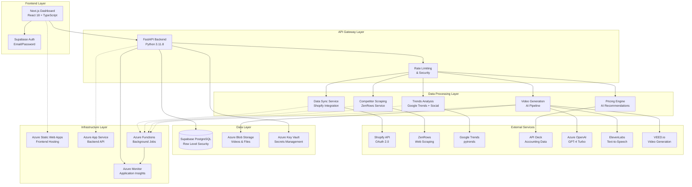
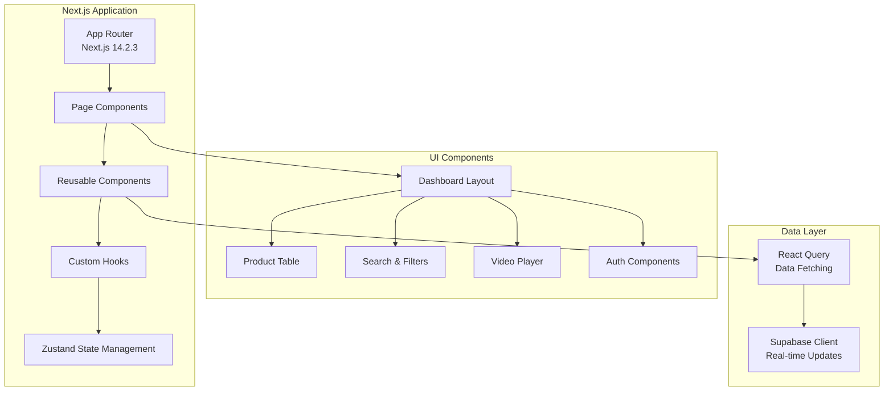
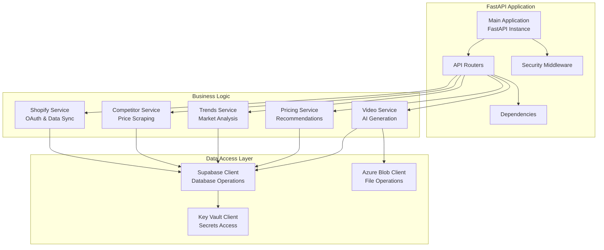
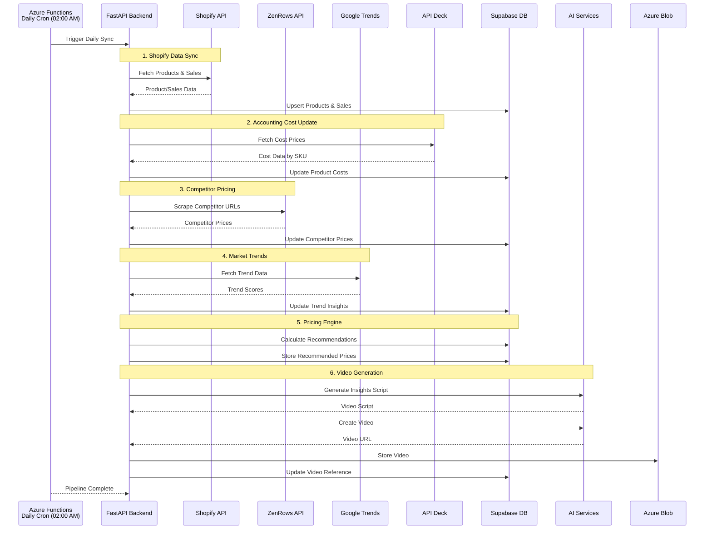
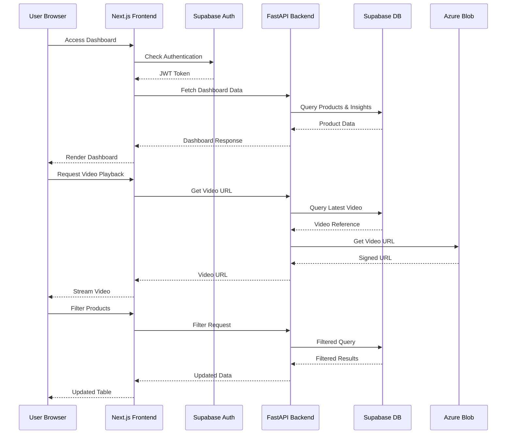
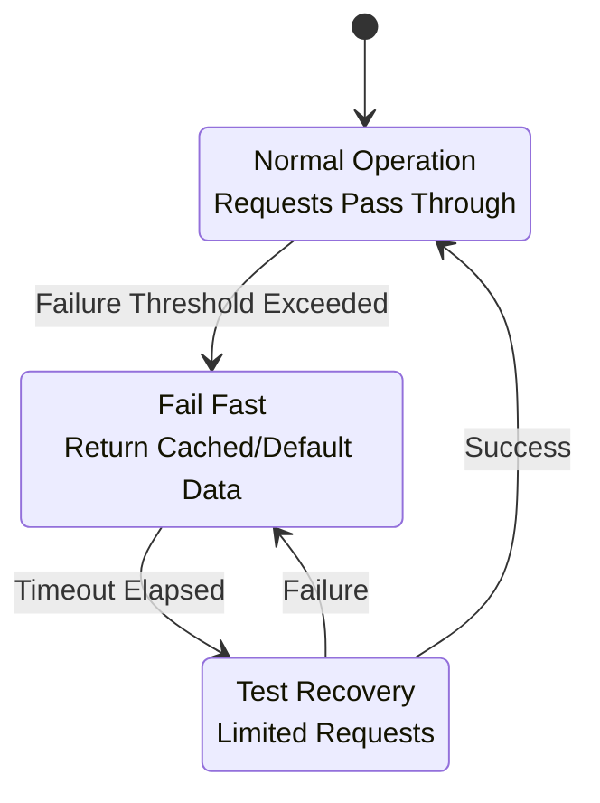

# System Architecture Overview

## High-Level Architecture

The Retail AI Advisor follows a modern microservices architecture pattern with clear separation of concerns, designed for rapid MVP development while maintaining scalability for future growth.

## Component Architecture

### Frontend Components

### Backend Services Architecture

## Data Flow Architecture

### Daily Data Processing Pipeline

### Real-time User Interaction Flow

## Service Communication Patterns

### Synchronous Communication
- **Frontend ↔ Backend**: REST API calls with JWT authentication
- **Backend ↔ Database**: Direct SQL queries via Supabase client
- **Backend ↔ External APIs**: HTTP requests with retry logic

### Asynchronous Communication
- **Background Jobs**: Azure Functions triggered by timer or queue
- **File Processing**: Event-driven blob storage operations
- **Real-time Updates**: Supabase real-time subscriptions (future enhancement)

## Error Handling & Resilience Patterns

### Circuit Breaker Pattern

### Retry Strategy
- **Exponential Backoff**: 1s, 2s, 4s, 8s intervals
- **Maximum Retries**: 3 attempts for external APIs
- **Jitter**: Random delay to prevent thundering herd
- **Circuit Breaker**: Fail fast after threshold

## Security Architecture Layers

### Defense in Depth
1. **Network Security**: Azure Virtual Network, NSGs
2. **Application Security**: JWT tokens, CORS, rate limiting
3. **Data Security**: Row Level Security, encryption at rest
4. **Secret Management**: Azure Key Vault integration
5. **Monitoring**: Application Insights, security alerts

## Scalability Considerations

### Horizontal Scaling
- **Frontend**: CDN distribution, multiple regions
- **Backend**: Load balancer with multiple App Service instances
- **Database**: Read replicas, connection pooling
- **Functions**: Consumption plan auto-scaling

### Vertical Scaling
- **App Service**: Scale up to higher SKUs
- **Database**: Increase compute and storage
- **Blob Storage**: Premium tier for higher IOPS

### Caching Strategy
- **Browser Cache**: Static assets, API responses
- **CDN Cache**: Global content distribution
- **Application Cache**: Redis for session data
- **Database Cache**: Query result caching

## Performance Optimization

### Frontend Optimization
- **Code Splitting**: Route-based lazy loading
- **Image Optimization**: Next.js Image component
- **Bundle Analysis**: Webpack bundle analyzer
- **Prefetching**: Link prefetching for navigation

### Backend Optimization
- **Database Indexing**: Strategic index placement
- **Query Optimization**: Efficient SQL queries
- **Connection Pooling**: Supabase connection management
- **Async Processing**: Background job queues

### Infrastructure Optimization
- **Auto-scaling**: Demand-based resource allocation
- **Load Balancing**: Traffic distribution
- **Monitoring**: Performance metrics and alerts
- **Cost Optimization**: Reserved instances, spot pricing

---

**Next**: [Database Schema Design](./02-database-schema.md)