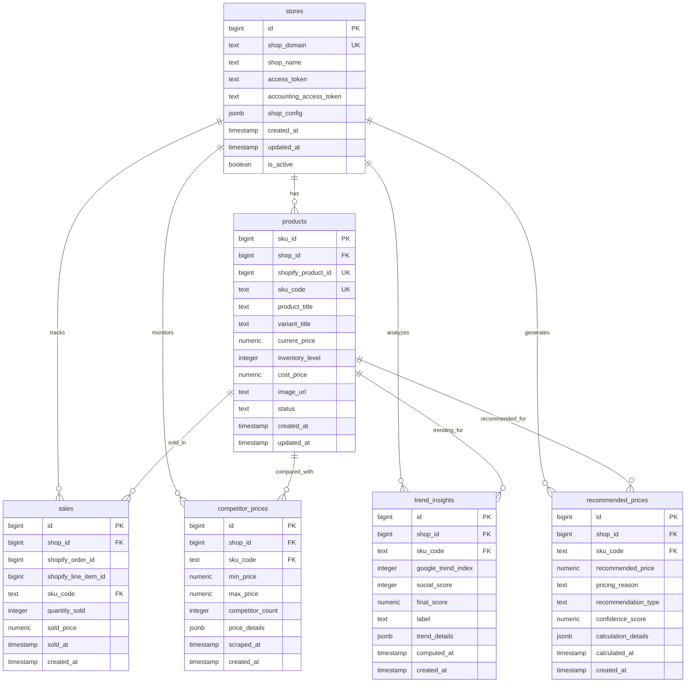

# Database Schema Design

## Overview

The Retail AI Advisor uses PostgreSQL via Supabase Cloud with Row Level Security (RLS) for multi-tenant data isolation. The schema is designed for the MVP while supporting future scalability requirements.

## Entity Relationship Diagram



## Complete SQL DDL Statements

### 1. Stores Table

```sql
-- Stores table for multi-tenant shop management
CREATE TABLE stores (
    id BIGSERIAL PRIMARY KEY,
    shop_domain TEXT NOT NULL UNIQUE,
    shop_name TEXT NOT NULL,
    access_token TEXT, -- Shopify OAuth access token
    accounting_access_token TEXT, -- API Deck access token
    shop_config JSONB DEFAULT '{}', -- Store configuration and settings
    created_at TIMESTAMP WITH TIME ZONE DEFAULT NOW(),
    updated_at TIMESTAMP WITH TIME ZONE DEFAULT NOW(),
    is_active BOOLEAN DEFAULT true,
    
    -- Constraints
    CONSTRAINT stores_shop_domain_format CHECK (shop_domain ~ '^[a-zA-Z0-9][a-zA-Z0-9\-]*[a-zA-Z0-9]*\.myshopify\.com$'),
    CONSTRAINT stores_shop_name_length CHECK (LENGTH(shop_name) >= 1 AND LENGTH(shop_name) <= 255)
);

-- Indexes for performance
CREATE INDEX idx_stores_shop_domain ON stores(shop_domain);
CREATE INDEX idx_stores_is_active ON stores(is_active);
CREATE INDEX idx_stores_created_at ON stores(created_at);

-- Row Level Security
ALTER TABLE stores ENABLE ROW LEVEL SECURITY;

-- RLS Policy: Users can only access their own store data
CREATE POLICY stores_isolation_policy ON stores
    FOR ALL
    USING (auth.uid()::text = (shop_config->>'user_id')::text);

-- Updated at trigger
CREATE OR REPLACE FUNCTION update_updated_at_column()
RETURNS TRIGGER AS $$
BEGIN
    NEW.updated_at = NOW();
    RETURN NEW;
END;
$$ language 'plpgsql';

CREATE TRIGGER update_stores_updated_at 
    BEFORE UPDATE ON stores 
    FOR EACH ROW 
    EXECUTE FUNCTION update_updated_at_column();
```

### 2. Products Table

```sql
-- Products table for SKU and inventory management
CREATE TABLE products (
    sku_id BIGSERIAL PRIMARY KEY,
    shop_id BIGINT NOT NULL REFERENCES stores(id) ON DELETE CASCADE,
    shopify_product_id BIGINT,
    sku_code TEXT NOT NULL,
    product_title TEXT NOT NULL,
    variant_title TEXT,
    current_price NUMERIC(10,2) NOT NULL CHECK (current_price >= 0),
    inventory_level INTEGER NOT NULL DEFAULT 0 CHECK (inventory_level >= 0),
    cost_price NUMERIC(10,2) DEFAULT 0.00 CHECK (cost_price >= 0),
    image_url TEXT,
    status TEXT DEFAULT 'active' CHECK (status IN ('active', 'archived', 'draft')),
    created_at TIMESTAMP WITH TIME ZONE DEFAULT NOW(),
    updated_at TIMESTAMP WITH TIME ZONE DEFAULT NOW(),
    
    -- Constraints
    CONSTRAINT products_sku_shop_unique UNIQUE (shop_id, sku_code),
    CONSTRAINT products_shopify_product_unique UNIQUE (shop_id, shopify_product_id),
    CONSTRAINT products_title_length CHECK (LENGTH(product_title) >= 1 AND LENGTH(product_title) <= 500),
    CONSTRAINT products_sku_code_format CHECK (sku_code ~ '^[A-Za-z0-9\-_]+$'),
    CONSTRAINT products_image_url_format CHECK (image_url IS NULL OR image_url ~ '^https?://.*\.(jpg|jpeg|png|gif|webp)(\?.*)?$')
);

-- Indexes for performance
CREATE INDEX idx_products_shop_id ON products(shop_id);
CREATE INDEX idx_products_sku_code ON products(sku_code);
CREATE INDEX idx_products_shopify_product_id ON products(shopify_product_id);
CREATE INDEX idx_products_status ON products(status);
CREATE INDEX idx_products_current_price ON products(current_price);
CREATE INDEX idx_products_inventory_level ON products(inventory_level);
CREATE INDEX idx_products_created_at ON products(created_at);
CREATE INDEX idx_products_updated_at ON products(updated_at);

-- Composite indexes for common queries
CREATE INDEX idx_products_shop_status ON products(shop_id, status);
CREATE INDEX idx_products_shop_sku ON products(shop_id, sku_code);

-- Row Level Security
ALTER TABLE products ENABLE ROW LEVEL SECURITY;

-- RLS Policy: Users can only access products from their stores
CREATE POLICY products_isolation_policy ON products
    FOR ALL
    USING (
        shop_id IN (
            SELECT id FROM stores 
            WHERE auth.uid()::text = (shop_config->>'user_id')::text
        )
    );

-- Updated at trigger
CREATE TRIGGER update_products_updated_at 
    BEFORE UPDATE ON products 
    FOR EACH ROW 
    EXECUTE FUNCTION update_updated_at_column();
```

### 3. Sales Table

```sql
-- Sales table for historical transaction data
CREATE TABLE sales (
    id BIGSERIAL PRIMARY KEY,
    shop_id BIGINT NOT NULL REFERENCES stores(id) ON DELETE CASCADE,
    shopify_order_id BIGINT NOT NULL,
    shopify_line_item_id BIGINT NOT NULL,
    sku_code TEXT NOT NULL,
    quantity_sold INTEGER NOT NULL CHECK (quantity_sold > 0),
    sold_price NUMERIC(10,2) NOT NULL CHECK (sold_price >= 0),
    sold_at TIMESTAMP WITH TIME ZONE NOT NULL,
    created_at TIMESTAMP WITH TIME ZONE DEFAULT NOW(),
    
    -- Constraints
    CONSTRAINT sales_shopify_line_item_unique UNIQUE (shop_id, shopify_order_id, shopify_line_item_id),
    CONSTRAINT sales_sku_code_fk FOREIGN KEY (shop_id, sku_code) REFERENCES products(shop_id, sku_code) ON DELETE CASCADE
);

-- Indexes for performance
CREATE INDEX idx_sales_shop_id ON sales(shop_id);
CREATE INDEX idx_sales_sku_code ON sales(sku_code);
CREATE INDEX idx_sales_sold_at ON sales(sold_at);
CREATE INDEX idx_sales_shopify_order_id ON sales(shopify_order_id);
CREATE INDEX idx_sales_created_at ON sales(created_at);

-- Composite indexes for analytics queries
CREATE INDEX idx_sales_shop_sku_date ON sales(shop_id, sku_code, sold_at);
CREATE INDEX idx_sales_shop_date ON sales(shop_id, sold_at);

-- Partitioning for large datasets (future enhancement)
-- CREATE TABLE sales_y2025m01 PARTITION OF sales FOR VALUES FROM ('2025-01-01') TO ('2025-02-01');

-- Row Level Security
ALTER TABLE sales ENABLE ROW LEVEL SECURITY;

-- RLS Policy: Users can only access sales from their stores
CREATE POLICY sales_isolation_policy ON sales
    FOR ALL
    USING (
        shop_id IN (
            SELECT id FROM stores 
            WHERE auth.uid()::text = (shop_config->>'user_id')::text
        )
    );
```

### 4. Competitor Prices Table

```sql
-- Competitor prices table for market pricing analysis
CREATE TABLE competitor_prices (
    id BIGSERIAL PRIMARY KEY,
    shop_id BIGINT NOT NULL REFERENCES stores(id) ON DELETE CASCADE,
    sku_code TEXT NOT NULL,
    min_price NUMERIC(10,2) CHECK (min_price >= 0),
    max_price NUMERIC(10,2) CHECK (max_price >= 0),
    competitor_count INTEGER DEFAULT 0 CHECK (competitor_count >= 0),
    price_details JSONB DEFAULT '{}', -- Store individual competitor prices and URLs
    scraped_at TIMESTAMP WITH TIME ZONE NOT NULL,
    created_at TIMESTAMP WITH TIME ZONE DEFAULT NOW(),
    
    -- Constraints
    CONSTRAINT competitor_prices_shop_sku_unique UNIQUE (shop_id, sku_code),
    CONSTRAINT competitor_prices_min_max_check CHECK (min_price IS NULL OR max_price IS NULL OR min_price <= max_price),
    CONSTRAINT competitor_prices_sku_code_fk FOREIGN KEY (shop_id, sku_code) REFERENCES products(shop_id, sku_code) ON DELETE CASCADE
);

-- Indexes for performance
CREATE INDEX idx_competitor_prices_shop_id ON competitor_prices(shop_id);
CREATE INDEX idx_competitor_prices_sku_code ON competitor_prices(sku_code);
CREATE INDEX idx_competitor_prices_scraped_at ON competitor_prices(scraped_at);
CREATE INDEX idx_competitor_prices_min_price ON competitor_prices(min_price);
CREATE INDEX idx_competitor_prices_max_price ON competitor_prices(max_price);

-- Composite indexes
CREATE INDEX idx_competitor_prices_shop_sku ON competitor_prices(shop_id, sku_code);

-- Row Level Security
ALTER TABLE competitor_prices ENABLE ROW LEVEL SECURITY;

-- RLS Policy: Users can only access competitor prices from their stores
CREATE POLICY competitor_prices_isolation_policy ON competitor_prices
    FOR ALL
    USING (
        shop_id IN (
            SELECT id FROM stores 
            WHERE auth.uid()::text = (shop_config->>'user_id')::text
        )
    );
```

### 5. Trend Insights Table

```sql
-- Trend insights table for market trend analysis
CREATE TABLE trend_insights (
    id BIGSERIAL PRIMARY KEY,
    shop_id BIGINT NOT NULL REFERENCES stores(id) ON DELETE CASCADE,
    sku_code TEXT NOT NULL,
    google_trend_index INTEGER DEFAULT 0 CHECK (google_trend_index >= 0 AND google_trend_index <= 100),
    social_score INTEGER DEFAULT 0 CHECK (social_score >= 0 AND social_score <= 100),
    final_score NUMERIC(5,2) DEFAULT 0.00 CHECK (final_score >= 0 AND final_score <= 100),
    label TEXT DEFAULT 'Steady' CHECK (label IN ('Hot', 'Rising', 'Steady', 'Declining')),
    trend_details JSONB DEFAULT '{}', -- Store detailed trend data and calculations
    computed_at TIMESTAMP WITH TIME ZONE NOT NULL,
    created_at TIMESTAMP WITH TIME ZONE DEFAULT NOW(),
    
    -- Constraints
    CONSTRAINT trend_insights_shop_sku_unique UNIQUE (shop_id, sku_code),
    CONSTRAINT trend_insights_sku_code_fk FOREIGN KEY (shop_id, sku_code) REFERENCES products(shop_id, sku_code) ON DELETE CASCADE
);

-- Indexes for performance
CREATE INDEX idx_trend_insights_shop_id ON trend_insights(shop_id);
CREATE INDEX idx_trend_insights_sku_code ON trend_insights(sku_code);
CREATE INDEX idx_trend_insights_label ON trend_insights(label);
CREATE INDEX idx_trend_insights_final_score ON trend_insights(final_score);
CREATE INDEX idx_trend_insights_computed_at ON trend_insights(computed_at);

-- Composite indexes
CREATE INDEX idx_trend_insights_shop_sku ON trend_insights(shop_id, sku_code);
CREATE INDEX idx_trend_insights_shop_label ON trend_insights(shop_id, label);

-- Row Level Security
ALTER TABLE trend_insights ENABLE ROW LEVEL SECURITY;

-- RLS Policy: Users can only access trend insights from their stores
CREATE POLICY trend_insights_isolation_policy ON trend_insights
    FOR ALL
    USING (
        shop_id IN (
            SELECT id FROM stores 
            WHERE auth.uid()::text = (shop_config->>'user_id')::text
        )
    );
```

### 6. Recommended Prices Table

```sql
-- Recommended prices table for AI-generated pricing recommendations
CREATE TABLE recommended_prices (
    id BIGSERIAL PRIMARY KEY,
    shop_id BIGINT NOT NULL REFERENCES stores(id) ON DELETE CASCADE,
    sku_code TEXT NOT NULL,
    recommended_price NUMERIC(10,2) NOT NULL CHECK (recommended_price >= 0),
    pricing_reason TEXT NOT NULL,
    recommendation_type TEXT DEFAULT 'standard' CHECK (recommendation_type IN ('underpriced', 'overpriced', 'competitive', 'trending', 'standard')),
    confidence_score NUMERIC(3,2) DEFAULT 0.50 CHECK (confidence_score >= 0 AND confidence_score <= 1),
    calculation_details JSONB DEFAULT '{}', -- Store calculation methodology and inputs
    calculated_at TIMESTAMP WITH TIME ZONE NOT NULL,
    created_at TIMESTAMP WITH TIME ZONE DEFAULT NOW(),
    
    -- Constraints
    CONSTRAINT recommended_prices_shop_sku_unique UNIQUE (shop_id, sku_code),
    CONSTRAINT recommended_prices_sku_code_fk FOREIGN KEY (shop_id, sku_code) REFERENCES products(shop_id, sku_code) ON DELETE CASCADE,
    CONSTRAINT recommended_prices_reason_length CHECK (LENGTH(pricing_reason) >= 10 AND LENGTH(pricing_reason) <= 500)
);

-- Indexes for performance
CREATE INDEX idx_recommended_prices_shop_id ON recommended_prices(shop_id);
CREATE INDEX idx_recommended_prices_sku_code ON recommended_prices(sku_code);
CREATE INDEX idx_recommended_prices_type ON recommended_prices(recommendation_type);
CREATE INDEX idx_recommended_prices_confidence ON recommended_prices(confidence_score);
CREATE INDEX idx_recommended_prices_calculated_at ON recommended_prices(calculated_at);

-- Composite indexes
CREATE INDEX idx_recommended_prices_shop_sku ON recommended_prices(shop_id, sku_code);
CREATE INDEX idx_recommended_prices_shop_type ON recommended_prices(shop_id, recommendation_type);

-- Row Level Security
ALTER TABLE recommended_prices ENABLE ROW LEVEL SECURITY;

-- RLS Policy: Users can only access recommendations from their stores
CREATE POLICY recommended_prices_isolation_policy ON recommended_prices
    FOR ALL
    USING (
        shop_id IN (
            SELECT id FROM stores 
            WHERE auth.uid()::text = (shop_config->>'user_id')::text
        )
    );
```

## Additional Database Objects

### Views for Common Queries

```sql
-- Comprehensive product view with all related data
CREATE VIEW product_insights AS
SELECT 
    p.sku_id,
    p.shop_id,
    p.sku_code,
    p.product_title,
    p.variant_title,
    p.current_price,
    p.inventory_level,
    p.cost_price,
    p.image_url,
    p.status,
    
    -- Competitor pricing
    cp.min_price as competitor_min_price,
    cp.max_price as competitor_max_price,
    cp.competitor_count,
    
    -- Trend insights
    ti.google_trend_index,
    ti.social_score,
    ti.final_score as trend_score,
    ti.label as trend_label,
    
    -- Recommendations
    rp.recommended_price,
    rp.pricing_reason,
    rp.recommendation_type,
    rp.confidence_score,
    
    -- Calculated fields
    CASE 
        WHEN p.cost_price > 0 THEN ROUND(((p.current_price - p.cost_price) / p.cost_price * 100), 2)
        ELSE NULL 
    END as current_margin_percent,
    
    CASE 
        WHEN rp.recommended_price IS NOT NULL AND p.cost_price > 0 
        THEN ROUND(((rp.recommended_price - p.cost_price) / p.cost_price * 100), 2)
        ELSE NULL 
    END as recommended_margin_percent,
    
    -- Timestamps
    p.updated_at as product_updated_at,
    cp.scraped_at as prices_updated_at,
    ti.computed_at as trends_updated_at,
    rp.calculated_at as recommendations_updated_at
    
FROM products p
LEFT JOIN competitor_prices cp ON p.shop_id = cp.shop_id AND p.sku_code = cp.sku_code
LEFT JOIN trend_insights ti ON p.shop_id = ti.shop_id AND p.sku_code = ti.sku_code
LEFT JOIN recommended_prices rp ON p.shop_id = rp.shop_id AND p.sku_code = rp.sku_code
WHERE p.status = 'active';

-- Sales analytics view
CREATE VIEW sales_analytics AS
SELECT 
    s.shop_id,
    s.sku_code,
    COUNT(*) as total_orders,
    SUM(s.quantity_sold) as total_quantity_sold,
    SUM(s.quantity_sold * s.sold_price) as total_revenue,
    AVG(s.sold_price) as average_selling_price,
    MIN(s.sold_at) as first_sale_date,
    MAX(s.sold_at) as last_sale_date,
    
    -- Last 30 days metrics
    COUNT(*) FILTER (WHERE s.sold_at >= NOW() - INTERVAL '30 days') as orders_last_30d,
    SUM(s.quantity_sold) FILTER (WHERE s.sold_at >= NOW() - INTERVAL '30 days') as quantity_last_30d,
    SUM(s.quantity_sold * s.sold_price) FILTER (WHERE s.sold_at >= NOW() - INTERVAL '30 days') as revenue_last_30d
    
FROM sales s
GROUP BY s.shop_id, s.sku_code;
```

### Functions for Business Logic

```sql
-- Function to calculate pricing recommendations
CREATE OR REPLACE FUNCTION calculate_pricing_recommendation(
    p_shop_id BIGINT,
    p_sku_code TEXT,
    p_current_price NUMERIC,
    p_cost_price NUMERIC,
    p_competitor_min NUMERIC DEFAULT NULL,
    p_competitor_max NUMERIC DEFAULT NULL,
    p_trend_score NUMERIC DEFAULT 50,
    p_min_margin_percent NUMERIC DEFAULT 30
)
RETURNS TABLE(
    recommended_price NUMERIC,
    pricing_reason TEXT,
    recommendation_type TEXT,
    confidence_score NUMERIC
) AS $$
DECLARE
    v_min_price NUMERIC;
    v_competitor_price NUMERIC;
    v_trend_adjustment NUMERIC;
    v_final_price NUMERIC;
    v_reason TEXT;
    v_type TEXT;
    v_confidence NUMERIC;
BEGIN
    -- Calculate minimum price based on cost + margin
    v_min_price := p_cost_price * (1 + p_min_margin_percent / 100);
    
    -- Determine competitor-based price
    IF p_competitor_min IS NOT NULL AND p_competitor_max IS NOT NULL THEN
        v_competitor_price := (p_competitor_min + p_competitor_max) / 2;
    ELSIF p_competitor_min IS NOT NULL THEN
        v_competitor_price := p_competitor_min * 1.05; -- 5% above minimum
    ELSE
        v_competitor_price := p_current_price; -- No competitor data
    END IF;
    
    -- Apply trend-based adjustment
    CASE 
        WHEN p_trend_score >= 80 THEN v_trend_adjustment := 1.10; -- Hot: +10%
        WHEN p_trend_score >= 60 THEN v_trend_adjustment := 1.05; -- Rising: +5%
        WHEN p_trend_score <= 20 THEN v_trend_adjustment := 0.95; -- Declining: -5%
        ELSE v_trend_adjustment := 1.0; -- Steady: no change
    END CASE;
    
    -- Calculate final recommended price
    v_final_price := GREATEST(v_min_price, v_competitor_price * v_trend_adjustment);
    
    -- Determine recommendation type and reason
    IF p_current_price < v_min_price THEN
        v_type := 'underpriced';
        v_reason := 'Current price below minimum margin threshold';
        v_confidence := 0.90;
    ELSIF p_current_price < v_competitor_price * 0.9 THEN
        v_type := 'underpriced';
        v_reason := 'Significantly below competitor pricing';
        v_confidence := 0.80;
    ELSIF p_current_price > v_competitor_price * 1.2 THEN
        v_type := 'overpriced';
        v_reason := 'Significantly above competitor pricing';
        v_confidence := 0.75;
    ELSIF p_trend_score >= 80 THEN
        v_type := 'trending';
        v_reason := 'High trend score allows for premium pricing';
        v_confidence := 0.70;
    ELSE
        v_type := 'competitive';
        v_reason := 'Price aligned with market conditions';
        v_confidence := 0.60;
    END IF;
    
    RETURN QUERY SELECT v_final_price, v_reason, v_type, v_confidence;
END;
$$ LANGUAGE plpgsql;
```

## Data Migration Strategy

### Initial Setup Script

```sql
-- Enable required extensions
CREATE EXTENSION IF NOT EXISTS "uuid-ossp";
CREATE EXTENSION IF NOT EXISTS "pg_stat_statements";

-- Create custom types
CREATE TYPE trend_label_enum AS ENUM ('Hot', 'Rising', 'Steady', 'Declining');
CREATE TYPE recommendation_type_enum AS ENUM ('underpriced', 'overpriced', 'competitive', 'trending', 'standard');
CREATE TYPE product_status_enum AS ENUM ('active', 'archived', 'draft');

-- Grant permissions for Supabase
GRANT USAGE ON SCHEMA public TO anon, authenticated;
GRANT ALL ON ALL TABLES IN SCHEMA public TO anon, authenticated;
GRANT ALL ON ALL SEQUENCES IN SCHEMA public TO anon, authenticated;
GRANT ALL ON ALL FUNCTIONS IN SCHEMA public TO anon, authenticated;
```

## Performance Optimization

### Indexing Strategy
- **Primary Keys**: Automatic B-tree indexes
- **Foreign Keys**: Explicit indexes for join performance
- **Query Patterns**: Composite indexes for common filter combinations
- **Time-based Queries**: Indexes on timestamp columns
- **Text Search**: Consider GIN indexes for JSONB columns (future enhancement)

### Partitioning Strategy (Future)
```sql
-- Partition sales table by month for large datasets
CREATE TABLE sales_partitioned (
    LIKE sales INCLUDING ALL
) PARTITION BY RANGE (sold_at);

-- Create monthly partitions
CREATE TABLE sales_y2025m01 PARTITION OF sales_partitioned 
FOR VALUES FROM ('2025-01-01') TO ('2025-02-01');
```

### Connection Pooling
- **Supabase**: Built-in connection pooling with PgBouncer
- **Application**: Connection pool size based on concurrent users
- **Monitoring**: Track connection usage and query performance

---

**Next**: [API Specifications](./03-api-specifications.md)