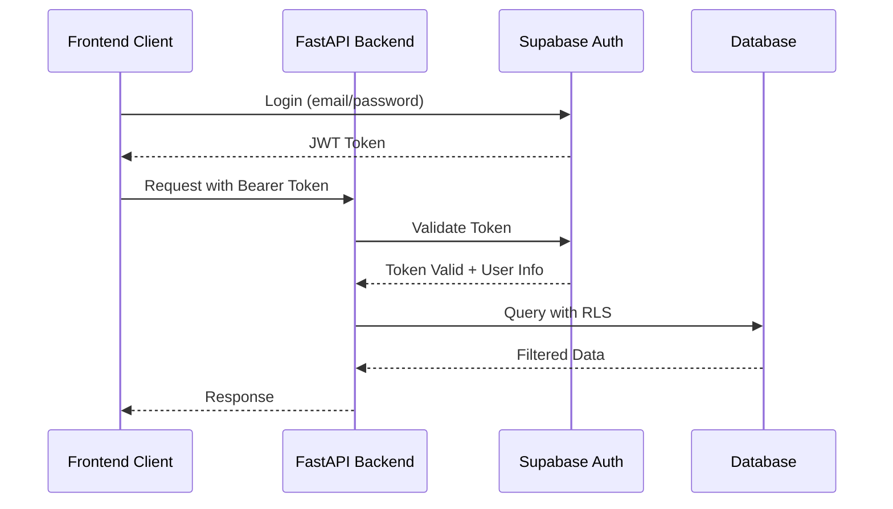

# API Specifications

## Overview

The Retail AI Advisor backend exposes a RESTful API built with FastAPI, providing secure endpoints for data synchronization, analysis, and dashboard operations. All endpoints follow OpenAPI 3.0 specifications with automatic documentation generation.

## Base Configuration

### API Base URL
- **Development**: `http://localhost:8000`
- **Production**: `https://retail-ai-advisor.azurewebsites.net`

### API Versioning
- **Current Version**: `v1`
- **Base Path**: `/api/v1`
- **Versioning Strategy**: URL path versioning for major changes

### Authentication
- **Type**: Bearer Token (JWT)
- **Header**: `Authorization: Bearer <token>`
- **Provider**: Supabase Auth
- **Token Expiry**: 1 hour (with refresh)

## API Endpoint Specifications

### Authentication Endpoints

#### POST /api/v1/auth/login
Login user and return JWT token.

```json
{
  "summary": "User login",
  "requestBody": {
    "content": {
      "application/json": {
        "schema": {
          "type": "object",
          "required": ["email", "password"],
          "properties": {
            "email": {
              "type": "string",
              "format": "email",
              "example": "user@example.com"
            },
            "password": {
              "type": "string",
              "minLength": 8,
              "example": "securepassword123"
            }
          }
        }
      }
    }
  },
  "responses": {
    "200": {
      "description": "Login successful",
      "content": {
        "application/json": {
          "schema": {
            "type": "object",
            "properties": {
              "access_token": {
                "type": "string",
                "example": "eyJhbGciOiJIUzI1NiIsInR5cCI6IkpXVCJ9..."
              },
              "token_type": {
                "type": "string",
                "example": "bearer"
              },
              "expires_in": {
                "type": "integer",
                "example": 3600
              },
              "user": {
                "$ref": "#/components/schemas/User"
              }
            }
          }
        }
      }
    },
    "401": {
      "description": "Invalid credentials",
      "content": {
        "application/json": {
          "schema": {
            "$ref": "#/components/schemas/ErrorResponse"
          }
        }
      }
    }
  }
}
```

#### POST /api/v1/auth/refresh
Refresh JWT token.

```json
{
  "summary": "Refresh access token",
  "security": [{"BearerAuth": []}],
  "responses": {
    "200": {
      "description": "Token refreshed successfully",
      "content": {
        "application/json": {
          "schema": {
            "type": "object",
            "properties": {
              "access_token": {
                "type": "string"
              },
              "expires_in": {
                "type": "integer"
              }
            }
          }
        }
      }
    }
  }
}
```

### Store Management Endpoints

#### GET /api/v1/stores/current
Get current user's store information.

```json
{
  "summary": "Get current store",
  "security": [{"BearerAuth": []}],
  "responses": {
    "200": {
      "description": "Store information",
      "content": {
        "application/json": {
          "schema": {
            "$ref": "#/components/schemas/Store"
          }
        }
      }
    },
    "404": {
      "description": "Store not found"
    }
  }
}
```

#### POST /api/v1/stores/shopify/connect
Connect Shopify store via OAuth.

```json
{
  "summary": "Connect Shopify store",
  "security": [{"BearerAuth": []}],
  "requestBody": {
    "content": {
      "application/json": {
        "schema": {
          "type": "object",
          "required": ["shop_domain", "code"],
          "properties": {
            "shop_domain": {
              "type": "string",
              "pattern": "^[a-zA-Z0-9][a-zA-Z0-9\\-]*[a-zA-Z0-9]*\\.myshopify\\.com$",
              "example": "my-store.myshopify.com"
            },
            "code": {
              "type": "string",
              "description": "OAuth authorization code from Shopify",
              "example": "abc123def456"
            }
          }
        }
      }
    }
  },
  "responses": {
    "201": {
      "description": "Store connected successfully",
      "content": {
        "application/json": {
          "schema": {
            "$ref": "#/components/schemas/Store"
          }
        }
      }
    },
    "400": {
      "description": "Invalid OAuth code or shop domain"
    }
  }
}
```

### Data Synchronization Endpoints

#### POST /api/v1/sync/shopify
Trigger Shopify data synchronization.

```json
{
  "summary": "Sync Shopify data",
  "security": [{"BearerAuth": []}],
  "requestBody": {
    "content": {
      "application/json": {
        "schema": {
          "type": "object",
          "properties": {
            "full_sync": {
              "type": "boolean",
              "default": false,
              "description": "Whether to perform full sync or incremental"
            },
            "sync_products": {
              "type": "boolean",
              "default": true
            },
            "sync_sales": {
              "type": "boolean",
              "default": true
            }
          }
        }
      }
    }
  },
  "responses": {
    "202": {
      "description": "Sync initiated",
      "content": {
        "application/json": {
          "schema": {
            "$ref": "#/components/schemas/SyncStatus"
          }
        }
      }
    },
    "409": {
      "description": "Sync already in progress"
    }
  }
}
```

#### GET /api/v1/sync/status
Get synchronization status.

```json
{
  "summary": "Get sync status",
  "security": [{"BearerAuth": []}],
  "responses": {
    "200": {
      "description": "Sync status",
      "content": {
        "application/json": {
          "schema": {
            "$ref": "#/components/schemas/SyncStatus"
          }
        }
      }
    }
  }
}
```

#### POST /api/v1/sync/competitor-prices
Update competitor pricing data.

```json
{
  "summary": "Sync competitor prices",
  "security": [{"BearerAuth": []}],
  "requestBody": {
    "content": {
      "application/json": {
        "schema": {
          "type": "array",
          "items": {
            "$ref": "#/components/schemas/CompetitorPriceUpdate"
          }
        }
      }
    }
  },
  "responses": {
    "200": {
      "description": "Competitor prices updated",
      "content": {
        "application/json": {
          "schema": {
            "type": "object",
            "properties": {
              "updated_count": {
                "type": "integer"
              },
              "failed_count": {
                "type": "integer"
              },
              "errors": {
                "type": "array",
                "items": {
                  "type": "string"
                }
              }
            }
          }
        }
      }
    }
  }
}
```

#### POST /api/v1/sync/trends
Update market trend data.

```json
{
  "summary": "Sync trend data",
  "security": [{"BearerAuth": []}],
  "requestBody": {
    "content": {
      "application/json": {
        "schema": {
          "type": "array",
          "items": {
            "$ref": "#/components/schemas/TrendUpdate"
          }
        }
      }
    }
  },
  "responses": {
    "200": {
      "description": "Trends updated successfully"
    }
  }
}
```

### Product Management Endpoints

#### GET /api/v1/products
Get products with filtering and pagination.

```json
{
  "summary": "Get products",
  "security": [{"BearerAuth": []}],
  "parameters": [
    {
      "name": "page",
      "in": "query",
      "schema": {
        "type": "integer",
        "minimum": 1,
        "default": 1
      }
    },
    {
      "name": "limit",
      "in": "query",
      "schema": {
        "type": "integer",
        "minimum": 1,
        "maximum": 100,
        "default": 20
      }
    },
    {
      "name": "search",
      "in": "query",
      "schema": {
        "type": "string",
        "description": "Search in product title or SKU"
      }
    },
    {
      "name": "status",
      "in": "query",
      "schema": {
        "type": "string",
        "enum": ["active", "archived", "draft"]
      }
    },
    {
      "name": "trend_label",
      "in": "query",
      "schema": {
        "type": "string",
        "enum": ["Hot", "Rising", "Steady", "Declining"]
      }
    },
    {
      "name": "recommendation_type",
      "in": "query",
      "schema": {
        "type": "string",
        "enum": ["underpriced", "overpriced", "competitive", "trending", "standard"]
      }
    }
  ],
  "responses": {
    "200": {
      "description": "Products retrieved successfully",
      "content": {
        "application/json": {
          "schema": {
            "$ref": "#/components/schemas/ProductListResponse"
          }
        }
      }
    }
  }
}
```

#### GET /api/v1/products/{sku_code}
Get specific product details.

```json
{
  "summary": "Get product by SKU",
  "security": [{"BearerAuth": []}],
  "parameters": [
    {
      "name": "sku_code",
      "in": "path",
      "required": true,
      "schema": {
        "type": "string"
      }
    }
  ],
  "responses": {
    "200": {
      "description": "Product details",
      "content": {
        "application/json": {
          "schema": {
            "$ref": "#/components/schemas/ProductDetail"
          }
        }
      }
    },
    "404": {
      "description": "Product not found"
    }
  }
}
```

### Analytics Endpoints

#### GET /api/v1/analytics/dashboard
Get dashboard analytics data.

```json
{
  "summary": "Get dashboard analytics",
  "security": [{"BearerAuth": []}],
  "responses": {
    "200": {
      "description": "Dashboard analytics",
      "content": {
        "application/json": {
          "schema": {
            "$ref": "#/components/schemas/DashboardAnalytics"
          }
        }
      }
    }
  }
}
```

#### GET /api/v1/analytics/insights
Get top business insights for AI video generation.

```json
{
  "summary": "Get business insights",
  "security": [{"BearerAuth": []}],
  "parameters": [
    {
      "name": "limit",
      "in": "query",
      "schema": {
        "type": "integer",
        "minimum": 1,
        "maximum": 10,
        "default": 3
      }
    }
  ],
  "responses": {
    "200": {
      "description": "Business insights",
      "content": {
        "application/json": {
          "schema": {
            "type": "array",
            "items": {
              "$ref": "#/components/schemas/BusinessInsight"
            }
          }
        }
      }
    }
  }
}
```

### AI Video Generation Endpoints

#### POST /api/v1/video/generate
Generate AI advisor video.

```json
{
  "summary": "Generate AI video",
  "security": [{"BearerAuth": []}],
  "requestBody": {
    "content": {
      "application/json": {
        "schema": {
          "type": "object",
          "properties": {
            "insights": {
              "type": "array",
              "items": {
                "$ref": "#/components/schemas/BusinessInsight"
              },
              "maxItems": 5
            },
            "voice_id": {
              "type": "string",
              "default": "default",
              "description": "ElevenLabs voice ID"
            },
            "video_template": {
              "type": "string",
              "default": "business",
              "enum": ["business", "casual", "professional"]
            }
          }
        }
      }
    }
  },
  "responses": {
    "202": {
      "description": "Video generation initiated",
      "content": {
        "application/json": {
          "schema": {
            "$ref": "#/components/schemas/VideoGenerationStatus"
          }
        }
      }
    }
  }
}
```

#### GET /api/v1/video/status/{job_id}
Get video generation status.

```json
{
  "summary": "Get video generation status",
  "security": [{"BearerAuth": []}],
  "parameters": [
    {
      "name": "job_id",
      "in": "path",
      "required": true,
      "schema": {
        "type": "string",
        "format": "uuid"
      }
    }
  ],
  "responses": {
    "200": {
      "description": "Video generation status",
      "content": {
        "application/json": {
          "schema": {
            "$ref": "#/components/schemas/VideoGenerationStatus"
          }
        }
      }
    }
  }
}
```

#### GET /api/v1/video/latest
Get latest generated video.

```json
{
  "summary": "Get latest video",
  "security": [{"BearerAuth": []}],
  "responses": {
    "200": {
      "description": "Latest video information",
      "content": {
        "application/json": {
          "schema": {
            "$ref": "#/components/schemas/GeneratedVideo"
          }
        }
      }
    },
    "404": {
      "description": "No videos found"
    }
  }
}
```

### File Upload Endpoints

#### POST /api/v1/upload/csv/products
Upload products CSV file.

```json
{
  "summary": "Upload products CSV",
  "security": [{"BearerAuth": []}],
  "requestBody": {
    "content": {
      "multipart/form-data": {
        "schema": {
          "type": "object",
          "required": ["file"],
          "properties": {
            "file": {
              "type": "string",
              "format": "binary",
              "description": "CSV file with products data"
            },
            "overwrite": {
              "type": "boolean",
              "default": false,
              "description": "Whether to overwrite existing products"
            }
          }
        }
      }
    }
  },
  "responses": {
    "200": {
      "description": "CSV processed successfully",
      "content": {
        "application/json": {
          "schema": {
            "$ref": "#/components/schemas/CSVUploadResult"
          }
        }
      }
    },
    "400": {
      "description": "Invalid CSV format or data"
    }
  }
}
```

#### POST /api/v1/upload/csv/sales
Upload sales CSV file.

```json
{
  "summary": "Upload sales CSV",
  "security": [{"BearerAuth": []}],
  "requestBody": {
    "content": {
      "multipart/form-data": {
        "schema": {
          "type": "object",
          "required": ["file"],
          "properties": {
            "file": {
              "type": "string",
              "format": "binary"
            }
          }
        }
      }
    }
  },
  "responses": {
    "200": {
      "description": "Sales CSV processed successfully"
    }
  }
}
```

## Data Models (Schemas)

### Core Models

```json
{
  "components": {
    "schemas": {
      "User": {
        "type": "object",
        "properties": {
          "id": {
            "type": "string",
            "format": "uuid"
          },
          "email": {
            "type": "string",
            "format": "email"
          },
          "created_at": {
            "type": "string",
            "format": "date-time"
          }
        }
      },
      "Store": {
        "type": "object",
        "properties": {
          "id": {
            "type": "integer",
            "format": "int64"
          },
          "shop_domain": {
            "type": "string",
            "example": "my-store.myshopify.com"
          },
          "shop_name": {
            "type": "string",
            "example": "My Awesome Store"
          },
          "is_active": {
            "type": "boolean"
          },
          "created_at": {
            "type": "string",
            "format": "date-time"
          },
          "updated_at": {
            "type": "string",
            "format": "date-time"
          }
        }
      },
      "Product": {
        "type": "object",
        "properties": {
          "sku_id": {
            "type": "integer",
            "format": "int64"
          },
          "sku_code": {
            "type": "string",
            "example": "SKU-001"
          },
          "product_title": {
            "type": "string",
            "example": "Premium Wireless Headphones"
          },
          "variant_title": {
            "type": "string",
            "example": "Black / Large"
          },
          "current_price": {
            "type": "number",
            "format": "decimal",
            "example": 99.99
          },
          "inventory_level": {
            "type": "integer",
            "example": 50
          },
          "cost_price": {
            "type": "number",
            "format": "decimal",
            "example": 45.00
          },
          "image_url": {
            "type": "string",
            "format": "uri",
            "example": "https://example.com/image.jpg"
          },
          "status": {
            "type": "string",
            "enum": ["active", "archived", "draft"]
          }
        }
      },
      "ProductDetail": {
        "allOf": [
          {
            "$ref": "#/components/schemas/Product"
          },
          {
            "type": "object",
            "properties": {
              "competitor_pricing": {
                "$ref": "#/components/schemas/CompetitorPricing"
              },
              "trend_insights": {
                "$ref": "#/components/schemas/TrendInsights"
              },
              "recommendation": {
                "$ref": "#/components/schemas/PriceRecommendation"
              },
              "sales_analytics": {
                "$ref": "#/components/schemas/SalesAnalytics"
              }
            }
          }
        ]
      },
      "CompetitorPricing": {
        "type": "object",
        "properties": {
          "min_price": {
            "type": "number",
            "format": "decimal"
          },
          "max_price": {
            "type": "number",
            "format": "decimal"
          },
          "competitor_count": {
            "type": "integer"
          },
          "scraped_at": {
            "type": "string",
            "format": "date-time"
          }
        }
      },
      "TrendInsights": {
        "type": "object",
        "properties": {
          "google_trend_index": {
            "type": "integer",
            "minimum": 0,
            "maximum": 100
          },
          "social_score": {
            "type": "integer",
            "minimum": 0,
            "maximum": 100
          },
          "final_score": {
            "type": "number",
            "format": "decimal",
            "minimum": 0,
            "maximum": 100
          },
          "label": {
            "type": "string",
            "enum": ["Hot", "Rising", "Steady", "Declining"]
          },
          "computed_at": {
            "type": "string",
            "format": "date-time"
          }
        }
      },
      "PriceRecommendation": {
        "type": "object",
        "properties": {
          "recommended_price": {
            "type": "number",
            "format": "decimal"
          },
          "pricing_reason": {
            "type": "string"
          },
          "recommendation_type": {
            "type": "string",
            "enum": ["underpriced", "overpriced", "competitive", "trending", "standard"]
          },
          "confidence_score": {
            "type": "number",
            "format": "decimal",
            "minimum": 0,
            "maximum": 1
          },
          "calculated_at": {
            "type": "string",
            "format": "date-time"
          }
        }
      },
      "SalesAnalytics": {
        "type": "object",
        "properties": {
          "total_orders": {
            "type": "integer"
          },
          "total_quantity_sold": {
            "type": "integer"
          },
          "total_revenue": {
            "type": "number",
            "format": "decimal"
          },
          "average_selling_price": {
            "type": "number",
            "format": "decimal"
          },
          "orders_last_30d": {
            "type": "integer"
          },
          "revenue_last_30d": {
            "type": "number",
            "format": "decimal"
          }
        }
      },
      "BusinessInsight": {
        "type": "object",
        "properties": {
          "type": {
            "type": "string",
            "enum": ["underpriced", "overstocked", "hot_product", "declining_trend", "competitor_alert"]
          },
          "title": {
            "type": "string",
            "example": "Underpriced Product Opportunity"
          },
          "description": {
            "type": "string",
            "example": "Premium Wireless Headphones could be priced 15% higher based on competitor analysis"
          },
          "impact_score": {
            "type": "number",
            "format": "decimal",
            "minimum": 0,
            "maximum": 100
          },
          "products": {
            "type": "array",
            "items": {
              "type": "string"
            },
            "description": "Array of SKU codes"
          },
          "recommended_action": {
            "type": "string"
          },
          "potential_revenue_impact": {
            "type": "number",
            "format": "decimal"
          }
        }
      },
      "GeneratedVideo": {
        "type": "object",
        "properties": {
          "id": {
            "type": "string",
            "format": "uuid"
          },
          "video_url": {
            "type": "string",
            "format": "uri"
          },
          "transcript": {
            "type": "string"
          },
          "duration": {
            "type": "integer",
            "description": "Duration in seconds"
          },
          "insights_count": {
            "type": "integer"
          },
          "generated_at": {
            "type": "string",
            "format": "date-time"
          }
        }
      },
      "SyncStatus": {
        "type": "object",
        "properties": {
          "status": {
            "type": "string",
            "enum": ["idle", "running", "completed", "failed"]
          },
          "progress": {
            "type": "integer",
            "minimum": 0,
            "maximum": 100
          },
          "current_step": {
            "type": "string"
          },
          "started_at": {
            "type": "string",
            "format": "date-time"
          },
          "completed_at": {
            "type": "string",
            "format": "date-time"
          },
          "error_message": {
            "type": "string"
          },
          "stats": {
            "type": "object",
            "properties": {
              "products_synced": {
                "type": "integer"
              },
              "sales_synced": {
                "type": "integer"
              },
              "errors_count": {
                "type": "integer"
              }
            }
          }
        }
      },
      "ErrorResponse": {
        "type": "object",
        "properties": {
          "error": {
            "type": "string"
          },
          "message": {
            "type": "string"
          },
          "details": {
            "type": "object"
          },
          "timestamp": {
            "type": "string",
            "format": "date-time"
          }
        }
      }
    }
  }
}
```

## API Security

### Authentication Flow


### Rate Limiting
- **Global**: 1000 requests per hour per IP
- **Authenticated**: 5000 requests per hour per user
- **Sync Endpoints**: 10 requests per hour per user
- **Video Generation**: 5 requests per hour per user

### Security Headers
```python
# FastAPI middleware configuration
app.add_middleware(
    CORSMiddleware,
    allow_origins=["https://retail-ai-advisor.vercel.app"],
    allow_credentials=True,
    allow_methods=["GET", "POST", "PUT", "DELETE"],
    allow_headers=["*"],
)

# Security headers
@app.middleware("http")
async def add_security_headers(request: Request, call_next):
    response = await call_next(request)
    response.headers["X-Content-Type-Options"] = "nosniff"
    response.headers["X-Frame-Options"] = "DENY"
    response.headers["X-XSS-Protection"] = "1; mode=block"
    response.headers["Strict-Transport-Security"] = "max-age=31536000; includeSubDomains"
    return response
```

## Error Handling

### HTTP Status Codes
- **200**: Success
- **201**: Created
- **202**: Accepted (async operations)
- **400**: Bad Request (validation errors)
- **401**: Unauthorized (authentication required)
- **403**: Forbidden (insufficient permissions)
- **404**: Not Found
- **409**: Conflict (resource already exists)
- **422**: Unprocessable Entity (validation errors)
- **429**: Too Many Requests (rate limited)
- **500**: Internal Server Error

### Error Response Format
```json
{
  "error": "VALIDATION_ERROR",
  "message": "Invalid input data",
  "details": {
    "field": "email",
    "issue": "Invalid email format"
  },
  "timestamp": "2025-05-31T10:00:00Z"
}
```

## Performance Considerations

### Response Time Targets
- **Authentication**: <200ms
- **Product Listing**: <500ms
- **Dashboard Analytics**: <1000ms
- **Data Sync**: <10 minutes (async)
- **Video Generation**: <5 minutes (async)

### Caching Strategy
- **Static Data**: 1 hour cache
- **Product Data**: 5 minutes cache
- **Analytics**: 15 minutes cache
- **User Sessions**: Redis cache

### Pagination
- **Default Page Size**: 20 items
- **Maximum Page Size**: 100 items
- **Cursor-based**: For large datasets (future enhancement)

---

**Next**: [Authentication & Security Architecture](./04-security-architecture.md)