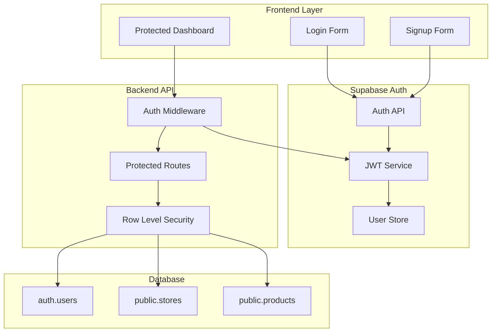
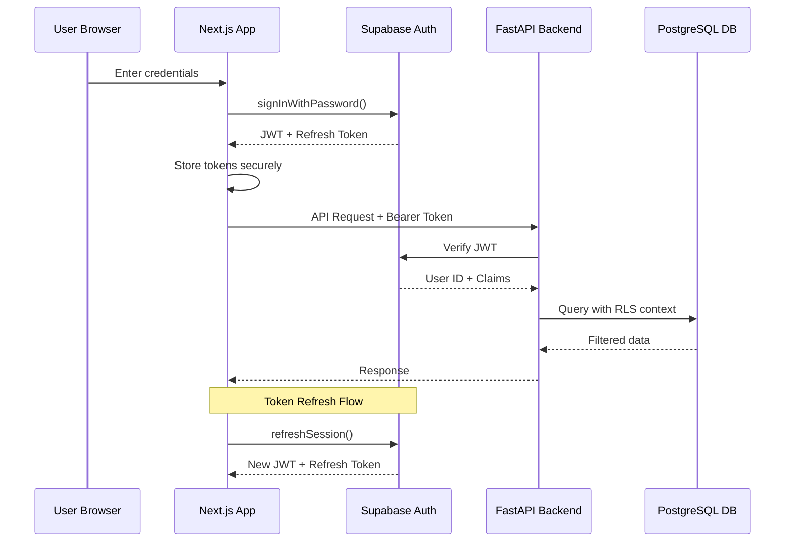
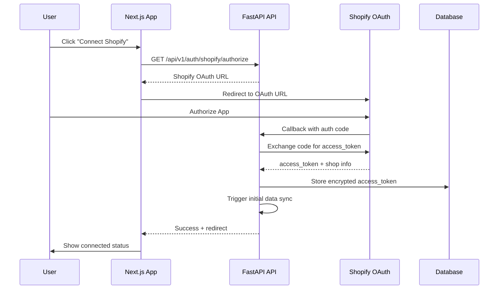
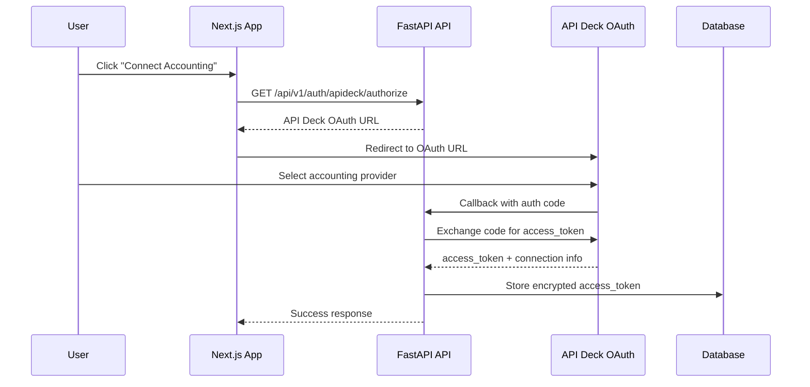
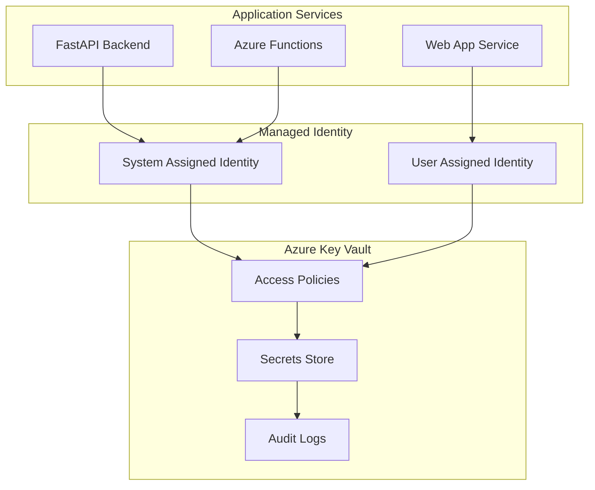

# Authentication & Security Architecture

## Overview

The Retail AI Advisor implements a comprehensive security architecture using industry best practices, including OAuth 2.0 flows, JWT token management, Row Level Security (RLS), and defense-in-depth strategies. Security is designed for the MVP while maintaining enterprise-grade standards.

## Authentication Architecture

### Supabase Auth Integration



### JWT Token Flow



## OAuth 2.0 Integration Flows

### Shopify OAuth 2.0 Flow



### API Deck OAuth 2.0 Flow



## Security Implementation Details

### JWT Token Management

#### Token Structure
```json
{
  "header": {
    "alg": "HS256",
    "typ": "JWT"
  },
  "payload": {
    "sub": "user-uuid-here",
    "email": "user@example.com",
    "aud": "authenticated",
    "exp": 1735689600,
    "iat": 1735686000,
    "iss": "https://your-project.supabase.co/auth/v1",
    "role": "authenticated"
  }
}
```

#### Token Validation Middleware
```python
from fastapi import HTTPException, Depends
from fastapi.security import HTTPBearer
import jwt
from supabase import create_client

security = HTTPBearer()

async def verify_token(token: str = Depends(security)):
    try:
        # Verify JWT with Supabase
        supabase = create_client(SUPABASE_URL, SUPABASE_ANON_KEY)
        user = supabase.auth.get_user(token.credentials)
        
        if not user:
            raise HTTPException(status_code=401, detail="Invalid token")
            
        return user
    except Exception as e:
        raise HTTPException(status_code=401, detail="Token validation failed")

# Usage in protected routes
@app.get("/api/v1/products")
async def get_products(current_user = Depends(verify_token)):
    # Access user.id for RLS context
    return await fetch_user_products(current_user.id)
```

### Row Level Security (RLS) Implementation

#### RLS Policies

```sql
-- Enable RLS on all tables
ALTER TABLE stores ENABLE ROW LEVEL SECURITY;
ALTER TABLE products ENABLE ROW LEVEL SECURITY;
ALTER TABLE sales ENABLE ROW LEVEL SECURITY;
ALTER TABLE competitor_prices ENABLE ROW LEVEL SECURITY;
ALTER TABLE trend_insights ENABLE ROW LEVEL SECURITY;
ALTER TABLE recommended_prices ENABLE ROW LEVEL SECURITY;

-- Store isolation policy
CREATE POLICY stores_user_isolation ON stores
    FOR ALL
    USING (auth.uid()::text = (shop_config->>'user_id')::text);

-- Product isolation policy
CREATE POLICY products_user_isolation ON products
    FOR ALL
    USING (
        shop_id IN (
            SELECT id FROM stores 
            WHERE auth.uid()::text = (shop_config->>'user_id')::text
        )
    );

-- Sales isolation policy
CREATE POLICY sales_user_isolation ON sales
    FOR ALL
    USING (
        shop_id IN (
            SELECT id FROM stores 
            WHERE auth.uid()::text = (shop_config->>'user_id')::text
        )
    );

-- Competitor prices isolation policy
CREATE POLICY competitor_prices_user_isolation ON competitor_prices
    FOR ALL
    USING (
        shop_id IN (
            SELECT id FROM stores 
            WHERE auth.uid()::text = (shop_config->>'user_id')::text
        )
    );

-- Trend insights isolation policy
CREATE POLICY trend_insights_user_isolation ON trend_insights
    FOR ALL
    USING (
        shop_id IN (
            SELECT id FROM stores 
            WHERE auth.uid()::text = (shop_config->>'user_id')::text
        )
    );

-- Recommended prices isolation policy
CREATE POLICY recommended_prices_user_isolation ON recommended_prices
    FOR ALL
    USING (
        shop_id IN (
            SELECT id FROM stores 
            WHERE auth.uid()::text = (shop_config->>'user_id')::text
        )
    );
```

#### RLS Context Setting
```python
from supabase import create_client

async def set_rls_context(user_id: str, supabase_client):
    """Set RLS context for database queries"""
    # Supabase automatically sets auth.uid() based on JWT
    # No manual context setting required
    return supabase_client

# Usage in service functions
async def get_user_products(user_id: str):
    supabase = create_client(SUPABASE_URL, SUPABASE_SERVICE_KEY)
    
    # Set auth context (if using service key)
    supabase.auth.set_session(user_jwt_token)
    
    # Query will automatically filter by RLS policies
    result = supabase.table('products').select('*').execute()
    return result.data
```

## Secret Management with Azure Key Vault

### Key Vault Architecture



### Secret Categories

#### Application Secrets
```json
{
  "secrets": {
    "database": {
      "SUPABASE_URL": "https://your-project.supabase.co",
      "SUPABASE_ANON_KEY": "eyJhbGciOiJIUzI1NiIsInR5cCI6IkpXVCJ9...",
      "SUPABASE_SERVICE_KEY": "eyJhbGciOiJIUzI1NiIsInR5cCI6IkpXVCJ9..."
    },
    "external_apis": {
      "SHOPIFY_CLIENT_ID": "your-shopify-client-id",
      "SHOPIFY_CLIENT_SECRET": "your-shopify-client-secret",
      "ZENROWS_API_KEY": "your-zenrows-api-key",
      "APIDECK_API_KEY": "your-apideck-api-key",
      "AZURE_OPENAI_API_KEY": "your-azure-openai-key",
      "ELEVENLABS_API_KEY": "your-elevenlabs-key",
      "VEED_API_KEY": "your-veed-api-key"
    },
    "encryption": {
      "JWT_SECRET": "your-jwt-secret-key",
      "ENCRYPTION_KEY": "your-data-encryption-key"
    },
    "storage": {
      "AZURE_STORAGE_CONNECTION_STRING": "DefaultEndpointsProtocol=https;..."
    }
  }
}
```

#### Key Vault Access Implementation
```python
from azure.keyvault.secrets import SecretClient
from azure.identity import DefaultAzureCredential
import os

class SecretManager:
    def __init__(self):
        # Use managed identity in production
        credential = DefaultAzureCredential()
        vault_url = os.getenv("AZURE_KEY_VAULT_URL")
        self.client = SecretClient(vault_url=vault_url, credential=credential)
        self._cache = {}
    
    async def get_secret(self, secret_name: str) -> str:
        """Get secret with caching"""
        if secret_name in self._cache:
            return self._cache[secret_name]
        
        try:
            secret = self.client.get_secret(secret_name)
            self._cache[secret_name] = secret.value
            return secret.value
        except Exception as e:
            logger.error(f"Failed to retrieve secret {secret_name}: {e}")
            raise
    
    async def refresh_cache(self):
        """Refresh secret cache"""
        self._cache.clear()

# Global secret manager instance
secret_manager = SecretManager()

# Usage in application
async def get_shopify_credentials():
    client_id = await secret_manager.get_secret("SHOPIFY-CLIENT-ID")
    client_secret = await secret_manager.get_secret("SHOPIFY-CLIENT-SECRET")
    return client_id, client_secret
```

## Data Encryption

### Encryption at Rest

#### Database Encryption
- **Supabase**: AES-256 encryption for all data at rest
- **Azure Blob Storage**: Server-side encryption with customer-managed keys
- **Key Vault**: Hardware Security Module (HSM) backed encryption

#### Application-Level Encryption
```python
from cryptography.fernet import Fernet
import base64

class DataEncryption:
    def __init__(self, encryption_key: str):
        self.cipher = Fernet(encryption_key.encode())
    
    def encrypt_sensitive_data(self, data: str) -> str:
        """Encrypt sensitive data like access tokens"""
        encrypted_data = self.cipher.encrypt(data.encode())
        return base64.b64encode(encrypted_data).decode()
    
    def decrypt_sensitive_data(self, encrypted_data: str) -> str:
        """Decrypt sensitive data"""
        decoded_data = base64.b64decode(encrypted_data.encode())
        decrypted_data = self.cipher.decrypt(decoded_data)
        return decrypted_data.decode()

# Usage for storing OAuth tokens
async def store_shopify_token(shop_id: int, access_token: str):
    encryption_key = await secret_manager.get_secret("ENCRYPTION-KEY")
    encryptor = DataEncryption(encryption_key)
    
    encrypted_token = encryptor.encrypt_sensitive_data(access_token)
    
    # Store encrypted token in database
    supabase.table('stores').update({
        'access_token': encrypted_token
    }).eq('id', shop_id).execute()
```

### Encryption in Transit

#### TLS Configuration
```python
# FastAPI TLS configuration
import ssl

# Production TLS settings
ssl_context = ssl.SSLContext(ssl.PROTOCOL_TLS_SERVER)
ssl_context.load_cert_chain('/path/to/cert.pem', '/path/to/key.pem')
ssl_context.set_ciphers('ECDHE+AESGCM:ECDHE+CHACHA20:DHE+AESGCM:DHE+CHACHA20:!aNULL:!MD5:!DSS')

# Run with TLS
if __name__ == "__main__":
    uvicorn.run(
        "main:app",
        host="0.0.0.0",
        port=443,
        ssl_context=ssl_context,
        ssl_keyfile="/path/to/key.pem",
        ssl_certfile="/path/to/cert.pem"
    )
```

## API Security

### Rate Limiting Implementation

```python
from slowapi import Limiter, _rate_limit_exceeded_handler
from slowapi.util import get_remote_address
from slowapi.errors import RateLimitExceeded

# Initialize rate limiter
limiter = Limiter(key_func=get_remote_address)
app.state.limiter = limiter
app.add_exception_handler(RateLimitExceeded, _rate_limit_exceeded_handler)

# Apply rate limits to endpoints
@app.post("/api/v1/sync/shopify")
@limiter.limit("10/hour")  # 10 syncs per hour
async def sync_shopify(request: Request, current_user = Depends(verify_token)):
    # Sync implementation
    pass

@app.post("/api/v1/video/generate")
@limiter.limit("5/hour")  # 5 video generations per hour
async def generate_video(request: Request, current_user = Depends(verify_token)):
    # Video generation implementation
    pass

# Global rate limit
@app.middleware("http")
@limiter.limit("1000/hour")
async def global_rate_limit(request: Request, call_next):
    response = await call_next(request)
    return response
```

### Input Validation & Sanitization

```python
from pydantic import BaseModel, validator, Field
from typing import Optional
import re

class ProductCreateRequest(BaseModel):
    sku_code: str = Field(..., regex=r'^[A-Za-z0-9\-_]+$', max_length=50)
    product_title: str = Field(..., min_length=1, max_length=500)
    current_price: float = Field(..., gt=0, le=999999.99)
    inventory_level: int = Field(..., ge=0)
    cost_price: Optional[float] = Field(None, ge=0)
    
    @validator('product_title')
    def sanitize_title(cls, v):
        # Remove potentially harmful characters
        return re.sub(r'[<>"\']', '', v).strip()
    
    @validator('sku_code')
    def validate_sku_format(cls, v):
        if not re.match(r'^[A-Za-z0-9\-_]+$', v):
            raise ValueError('SKU code contains invalid characters')
        return v.upper()

# SQL injection prevention with parameterized queries
async def get_products_by_filter(shop_id: int, search_term: str):
    # Using Supabase client with parameterized queries
    result = supabase.table('products').select('*').eq('shop_id', shop_id).ilike('product_title', f'%{search_term}%').execute()
    return result.data
```

### CORS Configuration

```python
from fastapi.middleware.cors import CORSMiddleware

# Production CORS settings
app.add_middleware(
    CORSMiddleware,
    allow_origins=[
        "https://retail-ai-advisor.vercel.app",
        "https://retail-ai-advisor.azurestaticapps.net"
    ],
    allow_credentials=True,
    allow_methods=["GET", "POST", "PUT", "DELETE"],
    allow_headers=["Authorization", "Content-Type"],
    expose_headers=["X-Total-Count", "X-Page-Count"]
)

# Development CORS (more permissive)
if os.getenv("ENVIRONMENT") == "development":
    app.add_middleware(
        CORSMiddleware,
        allow_origins=["http://localhost:3000"],
        allow_credentials=True,
        allow_methods=["*"],
        allow_headers=["*"]
    )
```

## Security Monitoring & Logging

### Security Event Logging

```python
import logging
from datetime import datetime
import json

# Security logger configuration
security_logger = logging.getLogger("security")
security_handler = logging.StreamHandler()
security_formatter = logging.Formatter(
    '%(asctime)s - SECURITY - %(levelname)s - %(message)s'
)
security_handler.setFormatter(security_formatter)
security_logger.addHandler(security_handler)
security_logger.setLevel(logging.INFO)

class SecurityLogger:
    @staticmethod
    def log_auth_attempt(email: str, success: bool, ip_address: str):
        event = {
            "event_type": "authentication_attempt",
            "email": email,
            "success": success,
            "ip_address": ip_address,
            "timestamp": datetime.utcnow().isoformat()
        }
        
        if success:
            security_logger.info(f"Successful login: {json.dumps(event)}")
        else:
            security_logger.warning(f"Failed login attempt: {json.dumps(event)}")
    
    @staticmethod
    def log_api_access(user_id: str, endpoint: str, method: str, status_code: int):
        event = {
            "event_type": "api_access",
            "user_id": user_id,
            "endpoint": endpoint,
            "method": method,
            "status_code": status_code,
            "timestamp": datetime.utcnow().isoformat()
        }
        security_logger.info(f"API access: {json.dumps(event)}")
    
    @staticmethod
    def log_data_access(user_id: str, table: str, operation: str, record_count: int):
        event = {
            "event_type": "data_access",
            "user_id": user_id,
            "table": table,
            "operation": operation,
            "record_count": record_count,
            "timestamp": datetime.utcnow().isoformat()
        }
        security_logger.info(f"Data access: {json.dumps(event)}")

# Usage in middleware
@app.middleware("http")
async def security_logging_middleware(request: Request, call_next):
    start_time = time.time()
    
    # Extract user info if authenticated
    user_id = None
    if "authorization" in request.headers:
        try:
            token = request.headers["authorization"].replace("Bearer ", "")
            user = await verify_token_silent(token)
            user_id = user.id if user else None
        except:
            pass
    
    response = await call_next(request)
    
    # Log API access
    if user_id:
        SecurityLogger.log_api_access(
            user_id=user_id,
            endpoint=str(request.url.path),
            method=request.method,
            status_code=response.status_code
        )
    
    return response
```

### Intrusion Detection

```python
from collections import defaultdict
from datetime import datetime, timedelta
import asyncio

class IntrusionDetection:
    def __init__(self):
        self.failed_attempts = defaultdict(list)
        self.blocked_ips = set()
    
    async def check_failed_login(self, ip_address: str, email: str):
        """Check for brute force attacks"""
        now = datetime.utcnow()
        
        # Clean old attempts (older than 1 hour)
        self.failed_attempts[ip_address] = [
            attempt for attempt in self.failed_attempts[ip_address]
            if now - attempt['timestamp'] < timedelta(hours=1)
        ]
        
        # Add current failed attempt
        self.failed_attempts[ip_address].append({
            'email': email,
            'timestamp': now
        })
        
        # Check if threshold exceeded (5 failed attempts in 1 hour)
        if len(self.failed_attempts[ip_address]) >= 5:
            self.blocked_ips.add(ip_address)
            security_logger.warning(f"IP blocked due to brute force: {ip_address}")
            
            # Send alert
            await self.send_security_alert(
                f"Brute force attack detected from IP: {ip_address}"
            )
    
    def is_ip_blocked(self, ip_address: str) -> bool:
        return ip_address in self.blocked_ips
    
    async def send_security_alert(self, message: str):
        """Send security alert to administrators"""
        # Implementation for sending alerts (email, Slack, etc.)
        security_logger.critical(f"SECURITY ALERT: {message}")

# Global intrusion detection instance
intrusion_detector = IntrusionDetection()

# Usage in authentication endpoint
@app.post("/api/v1/auth/login")
async def login(request: LoginRequest, client_ip: str = Depends(get_client_ip)):
    if intrusion_detector.is_ip_blocked(client_ip):
        raise HTTPException(status_code=429, detail="IP temporarily blocked")
    
    try:
        # Attempt authentication
        user = await authenticate_user(request.email, request.password)
        SecurityLogger.log_auth_attempt(request.email, True, client_ip)
        return {"access_token": generate_token(user)}
    except AuthenticationError:
        await intrusion_detector.check_failed_login(client_ip, request.email)
        SecurityLogger.log_auth_attempt(request.email, False, client_ip)
        raise HTTPException(status_code=401, detail="Invalid credentials")
```

## Compliance & Audit

### GDPR Compliance

```python
class GDPRCompliance:
    @staticmethod
    async def export_user_data(user_id: str) -> dict:
        """Export all user data for GDPR compliance"""
        supabase = create_client(SUPABASE_URL, SUPABASE_SERVICE_KEY)
        
        # Get user's stores
        stores = supabase.table('stores').select('*').eq('user_id', user_id).execute()
        
        user_data = {
            "user_id": user_id,
            "export_date": datetime.utcnow().isoformat(),
            "stores": stores.data,
            "products": [],
            "sales": [],
            "recommendations": []
        }
        
        # Get all related data for each store
        for store in stores.data:
            shop_id = store['id']
            
            products = supabase.table('products').select('*').eq('shop_id', shop_id).execute()
            sales = supabase.table('sales').select('*').eq('shop_id', shop_id).execute()
            recommendations = supabase.table('recommended_prices').select('*').eq('shop_id', shop_id).execute()
            
            user_data["products"].extend(products.data)
            user_data["sales"].extend(sales.data)
            user_data["recommendations"].extend(recommendations.data)
        
        return user_data
    
    @staticmethod
    async def delete_user_data(user_id: str):
        """Delete all user data for GDPR compliance"""
        supabase = create_client(SUPABASE_URL, SUPABASE_SERVICE_KEY)
        
        # Get user's stores
        stores = supabase.table('stores').select('id').eq('user_id', user_id).execute()
        
        for store in stores.data:
            shop_id = store['id']
            
            # Delete in correct order due to foreign key constraints
            supabase.table('recommended_prices').delete().eq('shop_id', shop_id).execute()
            supabase.table('trend_insights').delete().eq('shop_id', shop_id).execute()
            supabase.table('competitor_prices').delete().eq('shop_id', shop_id).execute()
            supabase.table('sales').delete().eq('shop_id', shop_id).execute()
            supabase.table('products').delete().eq('shop_id', shop_id).execute()
            supabase.table('stores').delete().eq('id', shop_id).execute()
        
        # Log deletion for audit trail
        security_logger.info(f"User data deleted for GDPR compliance: {user_id}")
```

### Audit Trail

```python
class AuditTrail:
    @staticmethod
    async def log_data_change(
        user_id: str,
        table: str,
        operation: str,
        record_id: str,
        old_values: dict = None,
        new_values: dict = None
    ):
        """Log data changes for audit trail"""
        audit_entry = {
            "user_id": user_id,
            "table": table,
            "operation": operation,
            "record_id": record_id,
            "old_values": old_values,
            "new_values": new_values,
            "timestamp": datetime.utcnow().isoformat(),
            "ip_address": get_current_ip(),
            "user_agent": get_current_user_agent()
        }
        
        # Store in audit log table or external logging service
        supabase.table('audit_logs').insert(audit_entry).execute()
        
        # Also log to security logger
        security_logger.info(f"Data change audit: {json.dumps(audit_entry)}")

# Usage in data modification endpoints
@app.put("/api/v1/products/{sku_code}")
async def update_product(
    sku_code: str,
    product_update: ProductUpdateRequest,
    current_user = Depends(verify_token)
):
    # Get current product data
    old_product = await get_product_by_sku(sku_code, current_user.id)
    
    # Update product
    updated_product = await update_product_data(sku_code, product_update, current_user.id)
    
    # Log audit trail
    await AuditTrail.log_data_change(
        user_id=current_user.id,
        table="products",
        operation="UPDATE",
        record_id=sku_code,
        old_values=old_product.dict(),
        new_values=updated_product.dict()
    )
    
    return updated_product
```

## Security Testing & Validation

### Automated Security Testing
```python
# Security test cases
import pytest
from fastapi.testclient import TestClient

class TestSecurity:
    def test_unauthorized_access(self):
        """Test that protected endpoints require authentication"""
        client = TestClient(app)
        response = client.get("/api/v1/products")
        assert response.status_code == 401
    
    def test_sql_injection_protection(self):
        """Test SQL injection protection"""
        client = TestClient(app)
        malicious_input = "'; DROP TABLE products; --"
        
        response = client.get(
            "/api/v1/products",
            params={"search": malicious_input},
            headers={"Authorization": f"Bearer {valid_token}"}
        )
        
        # Should not cause server error
        assert response.status_code in [200, 400]
    
    def test_xss_protection(self):
        """Test XSS protection in input fields"""
        client = TestClient(app)
        xss_payload = "<script>alert('xss')</script>"
        
        response = client.post(
            "/api/v1/products",
            json={"product_title": xss_payload, "sku_code": "TEST", "current_price": 10.0},
            headers={"Authorization": f"Bearer {valid_token}"}
        )
        
        # XSS payload should be sanitized
        if response.status_code == 201:
            assert "<script>" not in response.json()["product_title"]
    
    def test_rate_limiting(self):
        """Test rate limiting functionality"""
        client = TestClient(app)
        
        # Make multiple requests rapidly
        for i in range(15):
            response = client.post("/api/v1/sync/shopify")
        
        # Should be rate limited
        assert response.status_code == 429
```

---

**Next**: [External Service Integrations](./05-external-integrations.md)