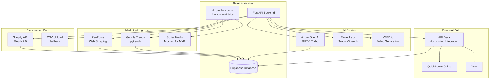

# External Service Integrations

## Overview

The Retail AI Advisor integrates with multiple external services to provide comprehensive data analysis and AI-powered insights. Each integration is designed with robust error handling, rate limiting, and fallback mechanisms to ensure system reliability.

## Integration Architecture



## Shopify Integration

### OAuth 2.0 Implementation

#### Configuration
```python
from dataclasses import dataclass
from typing import List

@dataclass
class ShopifyConfig:
    client_id: str
    client_secret: str
    scopes: List[str]
    redirect_uri: str
    api_version: str = "2024-07"
    
    @property
    def scope_string(self) -> str:
        return ",".join(self.scopes)

# Required scopes for MVP
SHOPIFY_SCOPES = [
    "read_products",
    "read_inventory", 
    "read_orders",
    "read_price_rules"  # For future discount analysis
]

shopify_config = ShopifyConfig(
    client_id=await secret_manager.get_secret("SHOPIFY-CLIENT-ID"),
    client_secret=await secret_manager.get_secret("SHOPIFY-CLIENT-SECRET"),
    scopes=SHOPIFY_SCOPES,
    redirect_uri="https://retail-ai-advisor.azurewebsites.net/api/v1/auth/shopify/callback"
)
```

#### OAuth Flow Implementation
```python
import hmac
import hashlib
import base64
from urllib.parse import urlencode, parse_qs
import httpx

class ShopifyOAuthService:
    def __init__(self, config: ShopifyConfig):
        self.config = config
        self.client = httpx.AsyncClient(timeout=30.0)
    
    def generate_auth_url(self, shop_domain: str, state: str) -> str:
        """Generate Shopify OAuth authorization URL"""
        params = {
            "client_id": self.config.client_id,
            "scope": self.config.scope_string,
            "redirect_uri": self.config.redirect_uri,
            "state": state,
            "grant_options[]": "per-user"
        }
        
        base_url = f"https://{shop_domain}/admin/oauth/authorize"
        return f"{base_url}?{urlencode(params)}"
    
    def verify_webhook_signature(self, data: bytes, signature: str) -> bool:
        """Verify Shopify webhook signature"""
        computed_signature = base64.b64encode(
            hmac.new(
                self.config.client_secret.encode(),
                data,
                hashlib.sha256
            ).digest()
        ).decode()
        
        return hmac.compare_digest(computed_signature, signature)
    
    async def exchange_code_for_token(self, shop_domain: str, code: str) -> dict:
        """Exchange authorization code for access token"""
        url = f"https://{shop_domain}/admin/oauth/access_token"
        
        payload = {
            "client_id": self.config.client_id,
            "client_secret": self.config.client_secret,
            "code": code
        }
        
        try:
            response = await self.client.post(url, json=payload)
            response.raise_for_status()
            return response.json()
        except httpx.HTTPError as e:
            logger.error(f"Failed to exchange Shopify code: {e}")
            raise ShopifyAuthError(f"Token exchange failed: {e}")
```

### Data Synchronization

#### Product Sync Implementation
```python
from typing import AsyncGenerator, Dict, Any
import asyncio
from datetime import datetime, timedelta

class ShopifyDataSync:
    def __init__(self, shop_domain: str, access_token: str):
        self.shop_domain = shop_domain
        self.access_token = access_token
        self.base_url = f"https://{shop_domain}/admin/api/2024-07"
        self.client = httpx.AsyncClient(
            headers={"X-Shopify-Access-Token": access_token},
            timeout=30.0
        )
        self.rate_limiter = ShopifyRateLimiter()
    
    async def sync_products(self, full_sync: bool = False) -> Dict[str, int]:
        """Sync products from Shopify"""
        stats = {"created": 0, "updated": 0, "errors": 0}
        
        try:
            async for product_batch in self._fetch_products_paginated():
                for product in product_batch:
                    try:
                        await self._process_product(product)
                        stats["updated"] += 1
                    except Exception as e:
                        logger.error(f"Error processing product {product.get('id')}: {e}")
                        stats["errors"] += 1
                
                # Respect rate limits
                await self.rate_limiter.wait_if_needed()
        
        except Exception as e:
            logger.error(f"Product sync failed: {e}")
            raise
        
        return stats
```

## ZenRows Web Scraping Integration

### Scraping Service Implementation

```python
from typing import List, Dict, Optional
import re
from bs4 import BeautifulSoup

class ZenRowsScrapingService:
    def __init__(self, api_key: str):
        self.api_key = api_key
        self.base_url = "https://api.zenrows.com/v1/"
        self.client = httpx.AsyncClient(timeout=60.0)
    
    async def scrape_competitor_prices(self, sku_configs: List[Dict]) -> List[Dict]:
        """Scrape competitor prices for multiple SKUs"""
        results = []
        
        for sku_config in sku_configs:
            sku_code = sku_config["sku_code"]
            competitor_urls = sku_config["competitor_urls"]
            
            prices = []
            for url_config in competitor_urls:
                try:
                    price = await self._scrape_single_price(url_config)
                    if price:
                        prices.append({
                            "competitor_name": url_config["competitor_name"],
                            "price": price,
                            "url": url_config["url"]
                        })
                except Exception as e:
                    logger.error(f"Failed to scrape {url_config['url']}: {e}")
            
            if prices:
                min_price = min(p["price"] for p in prices)
                max_price = max(p["price"] for p in prices)
                
                results.append({
                    "sku_code": sku_code,
                    "min_price": min_price,
                    "max_price": max_price,
                    "competitor_count": len(prices),
                    "price_details": prices,
                    "scraped_at": datetime.utcnow().isoformat()
                })
        
        return results
```

## Google Trends Integration

### PyTrends Implementation

```python
from pytrends.request import TrendReq
import pandas as pd
from typing import List, Dict
import asyncio
import random

class GoogleTrendsService:
    def __init__(self):
        self.pytrends = TrendReq(hl='en-GB', tz=0)
        self.request_delay = 1.0  # Delay between requests
    
    async def get_trends_for_products(self, product_titles: List[str]) -> List[Dict]:
        """Get Google Trends data for product titles"""
        results = []
        
        # Process in batches of 5 (pytrends limitation)
        for i in range(0, len(product_titles), 5):
            batch = product_titles[i:i+5]
            
            try:
                batch_results = await self._process_trends_batch(batch)
                results.extend(batch_results)
                
                # Add delay between batches to avoid rate limiting
                await asyncio.sleep(self.request_delay)
                
            except Exception as e:
                logger.error(f"Failed to process trends batch {batch}: {e}")
                # Add default values for failed batch
                for title in batch:
                    results.append({
                        "keyword": title,
                        "trend_index": 0,
                        "error": str(e)
                    })
        
        return results
```

## AI Services Integration

### Azure OpenAI Integration

```python
from openai import AsyncAzureOpenAI
from typing import List

class AzureOpenAIService:
    def __init__(self, api_key: str, endpoint: str, api_version: str = "2024-02-15-preview"):
        self.client = AsyncAzureOpenAI(
            api_key=api_key,
            azure_endpoint=endpoint,
            api_version=api_version
        )
        self.deployment_name = "gpt-4-turbo"
    
    async def generate_video_script(self, insights: List[Dict]) -> str:
        """Generate video script from business insights"""
        insights_text = self._format_insights_for_prompt(insights)
        
        prompt = f"""
        You are an AI business advisor creating a concise video script for a retail store owner.
        
        Based on these key business insights:
        {insights_text}
        
        Create a 45-60 second video script that:
        1. Starts with a friendly greeting
        2. Highlights the top 3 most important insights
        3. Provides clear, actionable recommendations
        4. Ends with encouragement and next steps
        5. Uses conversational, professional tone
        6. Includes specific numbers and product names
        
        Format as a natural speech script without stage directions.
        """
        
        try:
            response = await self.client.chat.completions.create(
                model=self.deployment_name,
                messages=[
                    {"role": "system", "content": "You are an expert business advisor who creates engaging, actionable video scripts for retail business owners."},
                    {"role": "user", "content": prompt}
                ],
                max_tokens=500,
                temperature=0.7
            )
            
            script = response.choices[0].message.content.strip()
            return script
            
        except Exception as e:
            logger.error(f"Failed to generate video script: {e}")
            raise AIServiceError(f"Script generation failed: {e}")
```

### ElevenLabs Text-to-Speech Integration

```python
class ElevenLabsService:
    def __init__(self, api_key: str):
        self.api_key = api_key
        self.base_url = "https://api.elevenlabs.io/v1"
        self.client = httpx.AsyncClient(
            headers={"xi-api-key": api_key},
            timeout=120.0  # TTS can take longer
        )
    
    async def generate_speech(self, text: str, voice_id: str = "21m00Tcm4TlvDq8ikWAM") -> bytes:
        """Generate speech from text"""
        url = f"{self.base_url}/text-to-speech/{voice_id}"
        
        payload = {
            "text": text,
            "model_id": "eleven_monolingual_v1",
            "voice_settings": {
                "stability": 0.5,
                "similarity_boost": 0.5,
                "style": 0.0,
                "use_speaker_boost": True
            }
        }
        
        try:
            response = await self.client.post(url, json=payload)
            response.raise_for_status()
            
            return response.content
            
        except httpx.HTTPError as e:
            logger.error(f"ElevenLabs TTS failed: {e}")
            raise AIServiceError(f"Text-to-speech generation failed: {e}")
```

### VEED.io Video Generation Integration

```python
class VeedIOService:
    def __init__(self, api_key: str):
        self.api_key = api_key
        self.base_url = "https://api.veed.io/v1"
        self.client = httpx.AsyncClient(
            headers={
                "Authorization": f"Bearer {api_key}",
                "Content-Type": "application/json"
            },
            timeout=300.0  # Video generation can take several minutes
        )
    
    async def create_video_from_audio(self, audio_url: str, script: str, template: str = "business") -> str:
        """Create video from audio and script"""
        payload = {
            "template": template,
            "audio_url": audio_url,
            "script": script,
            "settings": {
                "resolution": "1080p",
                "duration": "auto",
                "background": "corporate",
                "text_overlay": True,
                "branding": {
                    "logo_url": None,
                    "color_scheme": "#427F8C"  # Primary brand color
                }
            }
        }
        
        try:
            # Start video generation
            response = await self.client.post(f"{self.base_url}/videos", json=payload)
            response.raise_for_status()
            
            video_job = response.json()
            job_id = video_job["id"]
            
            # Poll for completion
            video_url = await self._poll_video_completion(job_id)
            return video_url
            
        except httpx.HTTPError as e:
            logger.error(f"VEED.io video creation failed: {e}")
            raise AIServiceError(f"Video generation failed: {e}")
    
    async def _poll_video_completion(self, job_id: str, max_wait: int = 300) -> str:
        """Poll for video completion"""
        start_time = time.time()
        
        while time.time() - start_time < max_wait:
            try:
                response = await self.client.get(f"{self.base_url}/videos/{job_id}")
                response.raise_for_status()
                
                video_data = response.json()
                status = video_data.get("status")
                
                if status == "completed":
                    return video_data.get("download_url")
                elif status == "failed":
                    raise AIServiceError("Video generation failed")
                
                # Wait before next poll
                await asyncio.sleep(10)
                
            except httpx.HTTPError as e:
                logger.error(f"Error polling video status: {e}")
                await asyncio.sleep(10)
        
        raise AIServiceError("Video generation timeout")
```

## Integration Orchestration

### Background Job Orchestration

```python
from typing import Dict, Any
import asyncio

class DataPipelineOrchestrator:
    def __init__(self):
        self.shopify_service = ShopifyDataSync()
        self.zenrows_service = ZenRowsScrapingService()
        self.trends_service = TrendsAnalysisService()
        self.apideck_service = APIdeckService()
        self.ai_service = AzureOpenAIService()
        self.tts_service = ElevenLabsService()
        self.video_service = VeedIOService()
    
    async def run_daily_pipeline(self, shop_id: int) -> Dict[str, Any]:
        """Run complete daily data pipeline"""
        pipeline_start = datetime.utcnow()
        results = {
            "started_at": pipeline_start.isoformat(),
            "steps": {},
            "errors": [],
            "status": "running"
        }
        
        try:
            # Step 1: Shopify Data Sync
            logger.info("Starting Shopify data sync...")
            shopify_result = await self._run_shopify_sync(shop_id)
            results["steps"]["shopify_sync"] = shopify_result
            
            # Step 2: Accounting Cost Update
            logger.info("Updating accounting costs...")
            cost_result = await self._run_cost_update(shop_id)
            results["steps"]["cost_update"] = cost_result
            
            # Step 3: Competitor Pricing (parallel with trends)
            logger.info("Starting competitor pricing and trends analysis...")
            competitor_task = self._run_competitor_scraping(shop_id)
            trends_task = self._run_trends_analysis(shop_id)
            
            competitor_result, trends_result = await asyncio.gather(
                competitor_task, trends_task, return_exceptions=True
            )
            
            results["steps"]["competitor_pricing"] = competitor_result
            results["steps"]["trends_analysis"] = trends_result
            
            # Step 4: Calculate Recommendations
            logger.info("Calculating pricing recommendations...")
            pricing_result = await self._run_pricing_engine(shop_id)
            results["steps"]["pricing_recommendations"] = pricing_result
            
            # Step 5: Generate AI Video
            logger.info("Generating AI advisor video...")
            video_result = await self._run_video_generation(shop_id)
            results["steps"]["video_generation"] = video_result
            
            results["status"] = "completed"
            results["completed_at"] = datetime.utcnow().isoformat()
            
        except Exception as e:
            logger.error(f"Pipeline failed: {e}")
            results["status"] = "failed"
            results["error"] = str(e)
            results["failed_at"] = datetime.utcnow().isoformat()
        
        # Log pipeline completion
        duration = (datetime.utcnow() - pipeline_start).total_seconds()
        logger.info(f"Pipeline completed in {duration:.2f} seconds with status: {results['status']}")
        
        return results
```

## Error Handling & Resilience

### Circuit Breaker Pattern

```python
import time
from enum import Enum
from typing import Callable, Any

class CircuitState(Enum):
    CLOSED = "closed"
    OPEN = "open"
    HALF_OPEN = "half_open"

class CircuitBreaker:
    def __init__(self, failure_threshold: int = 5, timeout: int = 60):
        self.failure_threshold = failure_threshold
        self.timeout = timeout
        self.failure_count = 0
        self.last_failure_time = None
        self.state = CircuitState.CLOSED
    
    async def call(self, func: Callable, *args, **kwargs) -> Any:
        """Execute function with circuit breaker protection"""
        if self.state == CircuitState.OPEN:
            if time.time() - self.last_failure_time > self.timeout:
                self.state = CircuitState.HALF_OPEN
            else:
                raise CircuitBreakerOpenError("Circuit breaker is open")
        
        try:
            result = await func(*args, **kwargs)
            self._on_success()
            return result
        except Exception as e:
            self._on_failure()
            raise
    
    def _on_success(self):
        """Handle successful call"""
        self.failure_count = 0
        self.state = CircuitState.CLOSED
    
    def _on_failure(self):
        """Handle failed call"""
        self.failure_count += 1
        self.last_failure_time = time.time()
        
        if self.failure_count >= self.failure_threshold:
            self.state = CircuitState.OPEN

# Usage with external services
shopify_circuit_breaker = CircuitBreaker(failure_threshold=3, timeout=300)
zenrows_circuit_breaker = CircuitBreaker(failure_threshold=5, timeout=600)

async def safe_shopify_call(func, *args, **kwargs):
    return await shopify_circuit_breaker.call(func, *args, **kwargs)
```

## Performance Monitoring

### Integration Metrics

```python
import time
from dataclasses import dataclass
from typing import Dict, List

@dataclass
class IntegrationMetrics:
    service_name: str
    operation: str
    duration: float
    success: bool
    error_message: str = None
    timestamp: datetime = None

class IntegrationMonitor:
    def __init__(self):
        self.metrics: List[IntegrationMetrics] = []
    
    async def monitor_integration(self, service_name: str, operation: str, func: Callable, *args, **kwargs):
        """Monitor integration performance"""
        start_time = time.time()
        success = False
        error_message = None
        
        try:
            result = await func(*args, **kwargs)
            success = True
            return result
        except Exception as e:
            error_message = str(e)
            raise
        finally:
            duration = time.time() - start_time
            
            metric = IntegrationMetrics(
                service_name=service_name,
                operation=operation,
                duration=duration,
                success=success,
                error_message=error_message,
                timestamp=datetime.utcnow()
            )
            
            self.metrics.append(metric)
            await self._log_metric(metric)
    
    async def _log_metric(self, metric: IntegrationMetrics):
        """Log metric to monitoring system"""
        logger.info(f"Integration metric: {metric.service_name}.{metric.operation} - {metric.duration:.2f}s - {'SUCCESS' if metric.success else 'FAILED'}")
        
        # Send to Application Insights or other monitoring
        if not metric.success:
            logger.error(f"Integration failure: {metric.service_name}.{metric.operation} - {metric.error_message}")

# Global monitor instance
integration_monitor = IntegrationMonitor()

# Usage
async def monitored_shopify_sync(shop_id: int):
    return await integration_monitor.monitor_integration(
        "shopify", "product_sync", 
        shopify_service.sync_products, shop_id
    )
```

---

**Next**: [Azure Deployment Architecture](./06-deployment-architecture.md)