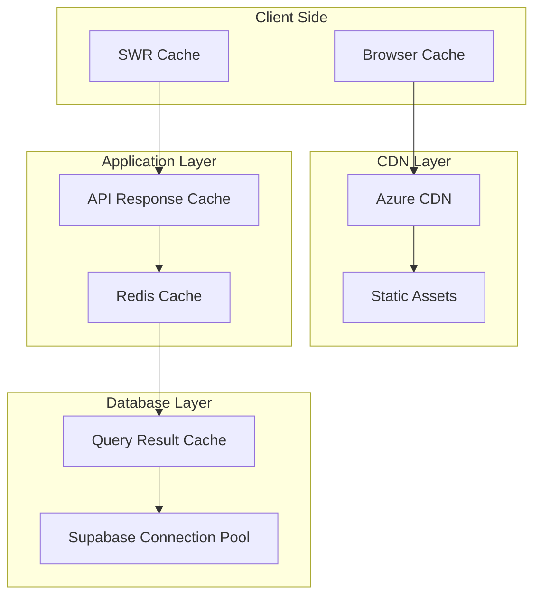

# Performance Optimization

## Overview

The Retail AI Advisor is designed to meet strict performance requirements while maintaining cost-effectiveness during the MVP phase. This document outlines comprehensive performance optimization strategies across all system components.

## Performance Requirements

| Component | Target | Measurement | Optimization Strategy |
|-----------|--------|-------------|----------------------|
| Dashboard Load | <500ms | Time to Interactive | Caching, Code Splitting, CDN |
| API Response | <200ms | P95 Response Time | Database Indexing, Connection Pooling |
| Data Sync | <10 minutes | Full Shopify Sync | Parallel Processing, Rate Limiting |
| Video Generation | <5 minutes | End-to-End Pipeline | Async Processing, Service Optimization |
| Daily Pipeline | <30 minutes | Complete Data Processing | Orchestration, Error Handling |

## Frontend Performance Optimization

### Next.js Optimization Strategy

```mermaid
graph TB
    subgraph "Build Time Optimizations"
        BUNDLE[Bundle Analysis]
        SPLIT[Code Splitting]
        TREE[Tree Shaking]
        COMPRESS[Compression]
    end
    
    subgraph "Runtime Optimizations"
        LAZY[Lazy Loading]
        PREFETCH[Prefetching]
        CACHE[Browser Caching]
        CDN[CDN Distribution]
    end
    
    subgraph "Data Optimizations"
        SSG[Static Generation]
        ISR[Incremental Static Regeneration]
        SWR[SWR Caching]
        PAGINATION[Pagination]
    end
    
    BUNDLE --> SPLIT
    SPLIT --> TREE
    TREE --> COMPRESS
    
    LAZY --> PREFETCH
    PREFETCH --> CACHE
    CACHE --> CDN
    
    SSG --> ISR
    ISR --> SWR
    SWR --> PAGINATION
```



### Next.js Configuration (`next.config.js`)
```javascript
/** @type {import('next').NextConfig} */
const nextConfig = {
  // Performance optimizations
  experimental: {
    optimizeCss: true,
    optimizePackageImports: ['@heroicons/react', 'lucide-react'],
  },
  
  // Image optimization
  images: {
    domains: ['cdn.shopify.com', 'retailaiadvisorstorage.blob.core.windows.net'],
    formats: ['image/webp', 'image/avif'],
    minimumCacheTTL: 86400, // 24 hours
  },
  
  // Compression
  compress: true,
  
  // Bundle analysis
  webpack: (config, { dev, isServer }) => {
    // Bundle analyzer in development
    if (dev && !isServer) {
      const { BundleAnalyzerPlugin } = require('webpack-bundle-analyzer');
      config.plugins.push(
        new BundleAnalyzerPlugin({
          analyzerMode: 'server',
          openAnalyzer: false,
        })
      );
    }
    
    return config;
  },
};

module.exports = nextConfig;
```

### Component-Level Optimizations
```typescript
// components/ProductTable.tsx
import { memo, useMemo, useCallback } from 'react';
import { useVirtualizer } from '@tanstack/react-virtual';

interface ProductTableProps {
  products: Product[];
  onProductSelect: (product: Product) => void;
}

export const ProductTable = memo<ProductTableProps>(({ products, onProductSelect }) => {
  // Memoize filtered and sorted data
  const processedProducts = useMemo(() => {
    return products
      .filter(product => product.status === 'active')
      .sort((a, b) => b.updated_at.localeCompare(a.updated_at));
  }, [products]);

  // Memoize callback to prevent re-renders
  const handleProductClick = useCallback((product: Product) => {
    onProductSelect(product);
  }, [onProductSelect]);

  // Virtual scrolling for large datasets
  const rowVirtualizer = useVirtualizer({
    count: processedProducts.length,
    getScrollElement: () => parentRef.current,
    estimateSize: () => 60,
    overscan: 10,
  });

  return (
    <div className="h-96 overflow-auto" ref={parentRef}>
      <div
        style={{
          height: `${rowVirtualizer.getTotalSize()}px`,
          width: '100%',
          position: 'relative',
        }}
      >
        {rowVirtualizer.getVirtualItems().map((virtualItem) => {
          const product = processedProducts[virtualItem.index];
          return (
            <ProductRow
              key={product.sku_id}
              product={product}
              onClick={handleProductClick}
              style={{
                position: 'absolute',
                top: 0,
                left: 0,
                width: '100%',
                height: `${virtualItem.size}px`,
                transform: `translateY(${virtualItem.start}px)`,
              }}
            />
          );
        })}
      </div>
    </div>
  );
});
```

## Backend Performance Optimization

### Database Optimization

#### Connection Pooling
```python
# database/connection.py
from supabase import create_client, Client
import os

class DatabasePool:
    def __init__(self):
        self._pool = None
        self._pool_size = int(os.getenv('DB_POOL_SIZE', '10'))
    
    async def get_client(self) -> Client:
        """Get database client with connection pooling"""
        if not self._pool:
            self._pool = create_client(
                os.getenv('SUPABASE_URL'),
                os.getenv('SUPABASE_SERVICE_KEY'),
                options={
                    'pool_size': self._pool_size,
                    'pool_timeout': 30,
                    'pool_recycle': 3600,  # 1 hour
                }
            )
        
        return self._pool

# Global database pool
db_pool = DatabasePool()
```

#### Query Optimization
```python
# services/product_service.py
from typing import List, Dict, Optional
from dataclasses import dataclass

@dataclass
class ProductQuery:
    shop_id: int
    page: int = 1
    limit: int = 20
    search: Optional[str] = None
    status: Optional[str] = None

class OptimizedProductService:
    def __init__(self, db_client):
        self.db = db_client
        self._cache = {}
        self._cache_ttl = 300  # 5 minutes
    
    async def get_products_with_insights(self, query: ProductQuery) -> Dict:
        """Get products with all related insights in a single optimized query"""
        
        # Check cache first
        cache_key = self._generate_cache_key(query)
        cached_result = self._get_from_cache(cache_key)
        if cached_result:
            return cached_result
        
        # Build optimized query with joins
        base_query = self.db.table('product_insights')  # Use the view we created
        
        # Apply filters
        if query.search:
            base_query = base_query.ilike('product_title', f'%{query.search}%')
        
        if query.status:
            base_query = base_query.eq('status', query.status)
        
        # Apply pagination and sorting
        offset = (query.page - 1) * query.limit
        base_query = base_query.eq('shop_id', query.shop_id)\
                              .order('updated_at', desc=True)\
                              .range(offset, offset + query.limit - 1)
        
        # Execute query
        result = base_query.execute()
        
        # Get total count for pagination
        total_count = await self._get_total_count(query)
        
        response = {
            'data': result.data,
            'total': total_count,
            'page': query.page,
            'limit': query.limit,
            'pages': (total_count + query.limit - 1) // query.limit
        }
        
        # Cache the result
        self._set_cache(cache_key, response)
        
        return response
```

## Caching Strategy

### Multi-Level Caching Architecture



### Redis Caching Implementation
```python
# services/cache_service.py
import redis.asyncio as redis
import pickle
from typing import Any, Optional
import hashlib

class CacheService:
    def __init__(self, redis_url: str):
        self.redis = redis.from_url(redis_url, decode_responses=False)
        self.default_ttl = 300  # 5 minutes
    
    async def get(self, key: str) -> Optional[Any]:
        """Get value from cache"""
        try:
            value = await self.redis.get(key)
            if value:
                return pickle.loads(value)
        except Exception as e:
            logging.error(f"Cache get error for key {key}: {e}")
        return None
    
    async def set(self, key: str, value: Any, ttl: int = None) -> bool:
        """Set value in cache"""
        try:
            ttl = ttl or self.default_ttl
            serialized_value = pickle.dumps(value)
            await self.redis.setex(key, ttl, serialized_value)
            return True
        except Exception as e:
            logging.error(f"Cache set error for key {key}: {e}")
            return False
    
    def generate_key(self, prefix: str, *args) -> str:
        """Generate cache key from prefix and arguments"""
        key_data = f"{prefix}:{':'.join(str(arg) for arg in args)}"
        return hashlib.md5(key_data.encode()).hexdigest()

# Cache decorators
def cached(ttl: int = 300, key_prefix: str = ""):
    """Decorator to cache function results"""
    def decorator(func):
        async def wrapper(*args, **kwargs):
            # Generate cache key
            cache_key = cache_service.generate_key(
                key_prefix or func.__name__,
                *args,
                *sorted(kwargs.items())
            )
            
            # Try to get from cache
            cached_result = await cache_service.get(cache_key)
            if cached_result is not None:
                return cached_result
            
            # Execute function and cache result
            result = await func(*args, **kwargs)
            await cache_service.set(cache_key, result, ttl)
            
            return result
        
        return wrapper
    return decorator
```

## Monitoring and Performance Metrics

### Application Performance Monitoring
```python
# monitoring/performance.py
import time
from functools import wraps
from typing import Dict, List
import logging

class PerformanceMonitor:
    def __init__(self):
        self.metrics: Dict[str, List[float]] = {}
        self.thresholds = {
            'api_response': 0.5,  # 500ms
            'database_query': 0.1,  # 100ms
            'external_api': 2.0,  # 2 seconds
        }
    
    def track_performance(self, operation_type: str, threshold: float = None):
        """Decorator to track operation performance"""
        def decorator(func):
            @wraps(func)
            async def wrapper(*args, **kwargs):
                start_time = time.time()
                
                try:
                    result = await func(*args, **kwargs)
                    success = True
                except Exception as e:
                    success = False
                    raise
                finally:
                    duration = time.time() - start_time
                    
                    # Record metric
                    if operation_type not in self.metrics:
                        self.metrics[operation_type] = []
                    
                    self.metrics[operation_type].append(duration)
                    
                    # Check threshold
                    threshold_value = threshold or self.thresholds.get(operation_type, 1.0)
                    if duration > threshold_value:
                        logging.warning(
                            f"Performance threshold exceeded: {operation_type} "
                            f"took {duration:.3f}s (threshold: {threshold_value}s)"
                        )
                
                return result
            
            return wrapper
        return decorator

# Global performance monitor
perf_monitor = PerformanceMonitor()
```

## Load Testing and Benchmarks

### Performance Benchmarks
```python
# tests/performance/benchmarks.py
import asyncio
import time
from concurrent.futures import ThreadPoolExecutor
import statistics

async def benchmark_api_endpoint(endpoint: str, concurrent_requests: int = 10, total_requests: int = 100):
    """Benchmark API endpoint performance"""
    
    async def make_request():
        start_time = time.time()
        # Make HTTP request here
        duration = time.time() - start_time
        return duration
    
    # Run concurrent requests
    semaphore = asyncio.Semaphore(concurrent_requests)
    
    async def limited_request():
        async with semaphore:
            return await make_request()
    
    # Execute all requests
    tasks = [limited_request() for _ in range(total_requests)]
    durations = await asyncio.gather(*tasks)
    
    # Calculate statistics
    return {
        'total_requests': total_requests,
        'concurrent_requests': concurrent_requests,
        'avg_response_time': statistics.mean(durations),
        'p50_response_time': statistics.median(durations),
        'p95_response_time': statistics.quantiles(durations, n=20)[18],  # 95th percentile
        'p99_response_time': statistics.quantiles(durations, n=100)[98],  # 99th percentile
        'min_response_time': min(durations),
        'max_response_time': max(durations),
    }

# Performance test suite
class PerformanceTestSuite:
    def __init__(self):
        self.results = {}
    
    async def run_all_benchmarks(self):
        """Run complete performance test suite"""
        
        # API endpoint benchmarks
        endpoints = [
            '/api/v1/products',
            '/api/v1/analytics/dashboard',
            '/api/v1/sync/status'
        ]
        
        for endpoint in endpoints:
            self.results[endpoint] = await benchmark_api_endpoint(endpoint)
        
        # Database query benchmarks
        self.results['database'] = await self.benchmark_database_queries()
        
        # External API benchmarks
        self.results['external_apis'] = await self.benchmark_external_apis()
        
        return self.results
    
    async def benchmark_database_queries(self):
        """Benchmark database query performance"""
        # Implementation for database benchmarks
        pass
    
    async def benchmark_external_apis(self):
        """Benchmark external API performance"""
        # Implementation for external API benchmarks
        pass
```

---

**Next**: [Project Structure & Organization](./08-project-structure.md)