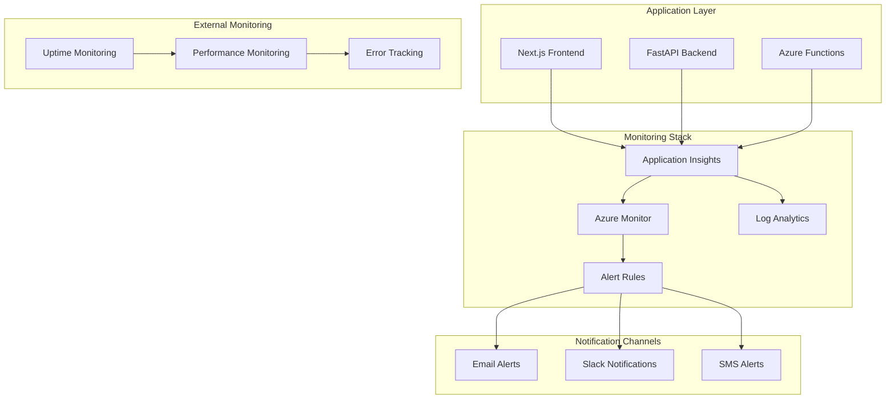

# Monitoring & Error Handling

## Overview

The Retail AI Advisor implements comprehensive monitoring, logging, and error handling strategies to ensure system reliability, performance visibility, and rapid issue resolution. This document outlines the complete observability stack and error management approach.

## Monitoring Architecture



## Application Insights Configuration

### Frontend Monitoring Setup

#### Next.js Application Insights Integration
```typescript
// src/lib/applicationInsights.ts
import { ApplicationInsights } from '@microsoft/applicationinsights-web';
import { ReactPlugin } from '@microsoft/applicationinsights-react-js';
import { createBrowserHistory } from 'history';

const browserHistory = createBrowserHistory({ basename: '' });
const reactPlugin = new ReactPlugin();

const appInsights = new ApplicationInsights({
  config: {
    connectionString: process.env.NEXT_PUBLIC_APPLICATIONINSIGHTS_CONNECTION_STRING,
    extensions: [reactPlugin],
    extensionConfig: {
      [reactPlugin.identifier]: { history: browserHistory }
    },
    enableAutoRouteTracking: true,
    enableCorsCorrelation: true,
    enableRequestHeaderTracking: true,
    enableResponseHeaderTracking: true,
    enableAjaxErrorStatusText: true,
    enableAjaxPerfTracking: true,
    maxAjaxCallsPerView: 20,
    disableExceptionTracking: false,
    disableTelemetry: process.env.NODE_ENV === 'development',
    samplingPercentage: process.env.NODE_ENV === 'production' ? 50 : 100,
  }
});

appInsights.loadAppInsights();

// Custom telemetry functions
export const trackEvent = (name: string, properties?: Record<string, any>) => {
  appInsights.trackEvent({ name, properties });
};

export const trackException = (error: Error, properties?: Record<string, any>) => {
  appInsights.trackException({ exception: error, properties });
};

export const trackPageView = (name: string, uri?: string) => {
  appInsights.trackPageView({ name, uri });
};

export const trackMetric = (name: string, average: number, properties?: Record<string, any>) => {
  appInsights.trackMetric({ name, average, properties });
};

export default appInsights;
```

#### React Error Boundary with Monitoring
```typescript
// src/components/common/ErrorBoundary.tsx
import React, { Component, ErrorInfo, ReactNode } from 'react';
import { trackException } from '@/lib/applicationInsights';

interface Props {
  children: ReactNode;
  fallback?: ReactNode;
}

interface State {
  hasError: boolean;
  error?: Error;
}

export class ErrorBoundary extends Component<Props, State> {
  public state: State = {
    hasError: false
  };

  public static getDerivedStateFromError(error: Error): State {
    return { hasError: true, error };
  }

  public componentDidCatch(error: Error, errorInfo: ErrorInfo) {
    console.error('Uncaught error:', error, errorInfo);
    
    // Track error in Application Insights
    trackException(error, {
      componentStack: errorInfo.componentStack,
      errorBoundary: true,
      timestamp: new Date().toISOString(),
    });
  }

  public render() {
    if (this.state.hasError) {
      return this.props.fallback || (
        <div className="min-h-screen flex items-center justify-center bg-gray-50">
          <div className="max-w-md w-full bg-white shadow-lg rounded-lg p-6">
            <div className="flex items-center">
              <div className="flex-shrink-0">
                <svg className="h-8 w-8 text-red-400" fill="none" viewBox="0 0 24 24" stroke="currentColor">
                  <path strokeLinecap="round" strokeLinejoin="round" strokeWidth={2} d="M12 9v2m0 4h.01m-6.938 4h13.856c1.54 0 2.502-1.667 1.732-2.5L13.732 4c-.77-.833-1.732-.833-2.5 0L3.732 16.5c-.77.833.192 2.5 1.732 2.5z" />
                </svg>
              </div>
              <div className="ml-3">
                <h3 className="text-sm font-medium text-gray-800">
                  Something went wrong
                </h3>
                <div className="mt-2 text-sm text-gray-500">
                  <p>We've been notified of this error and are working to fix it.</p>
                </div>
                <div className="mt-4">
                  <button
                    type="button"
                    className="bg-red-100 px-2 py-1 text-sm font-medium text-red-800 rounded-md hover:bg-red-200"
                    onClick={() => window.location.reload()}
                  >
                    Reload page
                  </button>
                </div>
              </div>
            </div>
          </div>
        </div>
      );
    }

    return this.props.children;
  }
}
```

### Backend Monitoring Setup

#### FastAPI Application Insights Integration
```python
# app/core/monitoring.py
import logging
import time
from typing import Dict, Any, Optional
from functools import wraps
from opencensus.ext.azure.log_exporter import AzureLogHandler
from opencensus.ext.azure.trace_exporter import AzureExporter
from opencensus.trace.tracer import Tracer
from opencensus.trace import config_integration
from opencensus.ext.requests import RequestsIntegrator
from fastapi import Request, Response
import os

# Configure integrations
config_integration.trace_integrations(['requests', 'sqlalchemy'])

class ApplicationInsightsLogger:
    def __init__(self, connection_string: str):
        self.connection_string = connection_string
        self.tracer = Tracer(exporter=AzureExporter(connection_string=connection_string))
        self.setup_logging()
    
    def setup_logging(self):
        """Setup Azure Application Insights logging"""
        # Create logger
        logger = logging.getLogger(__name__)
        logger.setLevel(logging.INFO)
        
        # Add Azure handler
        azure_handler = AzureLogHandler(connection_string=self.connection_string)
        azure_handler.setLevel(logging.INFO)
        
        # Create formatter
        formatter = logging.Formatter(
            '%(asctime)s - %(name)s - %(levelname)s - %(message)s'
        )
        azure_handler.setFormatter(formatter)
        
        # Add handler to logger
        logger.addHandler(azure_handler)
        
        self.logger = logger
    
    def track_event(self, name: str, properties: Dict[str, Any] = None):
        """Track custom event"""
        properties = properties or {}
        self.logger.info(f"EVENT: {name}", extra={'custom_dimensions': properties})
    
    def track_exception(self, exception: Exception, properties: Dict[str, Any] = None):
        """Track exception"""
        properties = properties or {}
        self.logger.exception(
            f"EXCEPTION: {str(exception)}", 
            extra={'custom_dimensions': properties}
        )
    
    def track_metric(self, name: str, value: float, properties: Dict[str, Any] = None):
        """Track custom metric"""
        properties = properties or {}
        properties['metric_value'] = value
        self.logger.info(f"METRIC: {name}", extra={'custom_dimensions': properties})
    
    def track_dependency(self, name: str, data: str, duration: float, success: bool):
        """Track dependency call"""
        properties = {
            'dependency_name': name,
            'dependency_data': data,
            'duration_ms': duration * 1000,
            'success': success
        }
        self.logger.info(f"DEPENDENCY: {name}", extra={'custom_dimensions': properties})

# Global monitoring instance
monitoring = ApplicationInsightsLogger(
    connection_string=os.getenv('APPLICATIONINSIGHTS_CONNECTION_STRING')
)

# Performance monitoring decorator
def monitor_performance(operation_name: str):
    """Decorator to monitor function performance"""
    def decorator(func):
        @wraps(func)
        async def wrapper(*args, **kwargs):
            start_time = time.time()
            success = True
            error = None
            
            try:
                result = await func(*args, **kwargs)
                return result
            except Exception as e:
                success = False
                error = e
                monitoring.track_exception(e, {
                    'operation': operation_name,
                    'function': func.__name__
                })
                raise
            finally:
                duration = time.time() - start_time
                
                # Track performance metric
                monitoring.track_metric(
                    f"{operation_name}_duration",
                    duration,
                    {
                        'operation': operation_name,
                        'function': func.__name__,
                        'success': success
                    }
                )
                
                # Track dependency if it's an external call
                if 'api' in operation_name.lower() or 'external' in operation_name.lower():
                    monitoring.track_dependency(
                        operation_name,
                        func.__name__,
                        duration,
                        success
                    )
        
        return wrapper
    return decorator

# Request monitoring middleware
async def monitoring_middleware(request: Request, call_next):
    """Middleware to monitor HTTP requests"""
    start_time = time.time()
    
    # Track request start
    monitoring.track_event("request_start", {
        'method': request.method,
        'url': str(request.url),
        'user_agent': request.headers.get('user-agent', ''),
        'ip_address': request.client.host if request.client else 'unknown'
    })
    
    try:
        response = await call_next(request)
        success = response.status_code < 400
    except Exception as e:
        monitoring.track_exception(e, {
            'request_method': request.method,
            'request_url': str(request.url)
        })
        raise
    finally:
        duration = time.time() - start_time
        
        # Track request completion
        monitoring.track_metric("request_duration", duration, {
            'method': request.method,
            'status_code': response.status_code if 'response' in locals() else 500,
            'success': success if 'success' in locals() else False
        })
    
    return response
```

#### Service-Level Monitoring
```python
# app/services/monitored_service.py
from app.core.monitoring import monitor_performance, monitoring
from typing import List, Dict, Any
import httpx

class MonitoredShopifyService:
    def __init__(self):
        self.client = httpx.AsyncClient()
    
    @monitor_performance("shopify_api_call")
    async def fetch_products(self, shop_domain: str, access_token: str) -> List[Dict[str, Any]]:
        """Fetch products from Shopify with monitoring"""
        try:
            url = f"https://{shop_domain}/admin/api/2024-07/products.json"
            headers = {"X-Shopify-Access-Token": access_token}
            
            response = await self.client.get(url, headers=headers)
            response.raise_for_status()
            
            products = response.json().get('products', [])
            
            # Track success metrics
            monitoring.track_metric("shopify_products_fetched", len(products), {
                'shop_domain': shop_domain,
                'status_code': response.status_code
            })
            
            return products
            
        except httpx.HTTPError as e:
            monitoring.track_exception(e, {
                'shop_domain': shop_domain,
                'error_type': 'http_error',
                'status_code': getattr(e.response, 'status_code', None)
            })
            raise
        except Exception as e:
            monitoring.track_exception(e, {
                'shop_domain': shop_domain,
                'error_type': 'general_error'
            })
            raise
```

## Structured Logging

### Logging Configuration
```python
# app/core/logging.py
import logging
import json
import sys
from datetime import datetime
from typing import Dict, Any
import os

class StructuredFormatter(logging.Formatter):
    """Custom formatter for structured logging"""
    
    def format(self, record: logging.LogRecord) -> str:
        # Base log structure
        log_entry = {
            'timestamp': datetime.utcnow().isoformat(),
            'level': record.levelname,
            'logger': record.name,
            'message': record.getMessage(),
            'module': record.module,
            'function': record.funcName,
            'line': record.lineno,
        }
        
        # Add exception info if present
        if record.exc_info:
            log_entry['exception'] = self.formatException(record.exc_info)
        
        # Add custom dimensions if present
        if hasattr(record, 'custom_dimensions'):
            log_entry['custom_dimensions'] = record.custom_dimensions
        
        # Add request context if available
        if hasattr(record, 'request_id'):
            log_entry['request_id'] = record.request_id
        
        if hasattr(record, 'user_id'):
            log_entry['user_id'] = record.user_id
        
        return json.dumps(log_entry)

def setup_logging():
    """Setup application logging configuration"""
    
    # Root logger configuration
    root_logger = logging.getLogger()
    root_logger.setLevel(logging.INFO)
    
    # Remove default handlers
    for handler in root_logger.handlers[:]:
        root_logger.removeHandler(handler)
    
    # Console handler with structured formatting
    console_handler = logging.StreamHandler(sys.stdout)
    console_handler.setLevel(logging.INFO)
    console_handler.setFormatter(StructuredFormatter())
    root_logger.addHandler(console_handler)
    
    # Application-specific logger
    app_logger = logging.getLogger('retail_ai_advisor')
    app_logger.setLevel(logging.DEBUG if os.getenv('DEBUG') == 'true' else logging.INFO)
    
    return app_logger

# Context manager for request logging
class LoggingContext:
    def __init__(self, request_id: str, user_id: str = None):
        self.request_id = request_id
        self.user_id = user_id
        self.old_factory = logging.getLogRecordFactory()
    
    def __enter__(self):
        def record_factory(*args, **kwargs):
            record = self.old_factory(*args, **kwargs)
            record.request_id = self.request_id
            if self.user_id:
                record.user_id = self.user_id
            return record
        
        logging.setLogRecordFactory(record_factory)
        return self
    
    def __exit__(self, exc_type, exc_val, exc_tb):
        logging.setLogRecordFactory(self.old_factory)

# Usage in FastAPI middleware
async def logging_middleware(request: Request, call_next):
    """Middleware to add request context to logs"""
    import uuid
    
    request_id = str(uuid.uuid4())
    user_id = getattr(request.state, 'user_id', None)
    
    with LoggingContext(request_id, user_id):
        logger = logging.getLogger('retail_ai_advisor')
        logger.info("Request started", extra={
            'custom_dimensions': {
                'method': request.method,
                'url': str(request.url),
                'request_id': request_id
            }
        })
        
        try:
            response = await call_next(request)
            logger.info("Request completed", extra={
                'custom_dimensions': {
                    'status_code': response.status_code,
                    'request_id': request_id
                }
            })
            return response
        except Exception as e:
            logger.error("Request failed", extra={
                'custom_dimensions': {
                    'error': str(e),
                    'request_id': request_id
                }
            })
            raise
```

## Error Handling Strategy

### Global Error Handlers

#### FastAPI Exception Handlers
```python
# app/api/error_handlers.py
from fastapi import FastAPI, Request, HTTPException
from fastapi.responses import JSONResponse
from fastapi.exceptions import RequestValidationError
from starlette.exceptions import HTTPException as StarletteHTTPException
import logging
from app.core.monitoring import monitoring
from app.utils.exceptions import (
    ShopifyAPIError,
    ExternalServiceError,
    BusinessLogicError,
    DatabaseError
)

logger = logging.getLogger(__name__)

def setup_error_handlers(app: FastAPI):
    """Setup global error handlers for the FastAPI application"""
    
    @app.exception_handler(HTTPException)
    async def http_exception_handler(request: Request, exc: HTTPException):
        """Handle HTTP exceptions"""
        monitoring.track_event("http_exception", {
            'status_code': exc.status_code,
            'detail': exc.detail,
            'url': str(request.url),
            'method': request.method
        })
        
        return JSONResponse(
            status_code=exc.status_code,
            content={
                "error": "HTTP_ERROR",
                "message": exc.detail,
                "status_code": exc.status_code,
                "timestamp": datetime.utcnow().isoformat()
            }
        )
    
    @app.exception_handler(RequestValidationError)
    async def validation_exception_handler(request: Request, exc: RequestValidationError):
        """Handle request validation errors"""
        monitoring.track_event("validation_error", {
            'errors': exc.errors(),
            'url': str(request.url),
            'method': request.method
        })
        
        return JSONResponse(
            status_code=422,
            content={
                "error": "VALIDATION_ERROR",
                "message": "Request validation failed",
                "details": exc.errors(),
                "timestamp": datetime.utcnow().isoformat()
            }
        )
    
    @app.exception_handler(ShopifyAPIError)
    async def shopify_api_exception_handler(request: Request, exc: ShopifyAPIError):
        """Handle Shopify API errors"""
        monitoring.track_exception(exc, {
            'error_type': 'shopify_api_error',
            'url': str(request.url),
            'method': request.method
        })
        
        return JSONResponse(
            status_code=502,
            content={
                "error": "SHOPIFY_API_ERROR",
                "message": "Shopify API integration error",
                "details": str(exc),
                "timestamp": datetime.utcnow().isoformat()
            }
        )
    
    @app.exception_handler(ExternalServiceError)
    async def external_service_exception_handler(request: Request, exc: ExternalServiceError):
        """Handle external service errors"""
        monitoring.track_exception(exc, {
            'error_type': 'external_service_error',
            'service': exc.service_name if hasattr(exc, 'service_name') else 'unknown',
            'url': str(request.url),
            'method': request.method
        })
        
        return JSONResponse(
            status_code=503,
            content={
                "error": "EXTERNAL_SERVICE_ERROR",
                "message": "External service temporarily unavailable",
                "details": str(exc),
                "timestamp": datetime.utcnow().isoformat()
            }
        )
    
    @app.exception_handler(DatabaseError)
    async def database_exception_handler(request: Request, exc: DatabaseError):
        """Handle database errors"""
        monitoring.track_exception(exc, {
            'error_type': 'database_error',
            'url': str(request.url),
            'method': request.method
        })
        
        return JSONResponse(
            status_code=500,
            content={
                "error": "DATABASE_ERROR",
                "message": "Database operation failed",
                "timestamp": datetime.utcnow().isoformat()
            }
        )
    
    @app.exception_handler(Exception)
    async def general_exception_handler(request: Request, exc: Exception):
        """Handle all other exceptions"""
        logger.exception("Unhandled exception occurred")
        
        monitoring.track_exception(exc, {
            'error_type': 'unhandled_exception',
            'url': str(request.url),
            'method': request.method
        })
        
        return JSONResponse(
            status_code=500,
            content={
                "error": "INTERNAL_SERVER_ERROR",
                "message": "An unexpected error occurred",
                "timestamp": datetime.utcnow().isoformat()
            }
        )
```

### Custom Exception Classes
```python
# app/utils/exceptions.py
class BaseCustomException(Exception):
    """Base exception class for custom exceptions"""
    
    def __init__(self, message: str, details: dict = None):
        self.message = message
        self.details = details or {}
        super().__init__(self.message)

class ShopifyAPIError(BaseCustomException):
    """Exception for Shopify API related errors"""
    pass

class ExternalServiceError(BaseCustomException):
    """Exception for external service errors"""
    
    def __init__(self, message: str, service_name: str, details: dict = None):
        self.service_name = service_name
        super().__init__(message, details)

class BusinessLogicError(BaseCustomException):
    """Exception for business logic errors"""
    pass

class DatabaseError(BaseCustomException):
    """Exception for database related errors"""
    pass

class AuthenticationError(BaseCustomException):
    """Exception for authentication errors"""
    pass

class AuthorizationError(BaseCustomException):
    """Exception for authorization errors"""
    pass
```

## Alert Configuration

### Azure Monitor Alert Rules
```bicep
// infrastructure/modules/monitoring.bicep
resource alertRules 'Microsoft.Insights/metricAlerts@2018-03-01' = [
  {
    name: 'High Error Rate Alert'
    location: 'global'
    properties: {
      description: 'Alert when error rate exceeds 5%'
      severity: 2
      enabled: true
      scopes: [
        appService.id
      ]
      evaluationFrequency: 'PT5M'
      windowSize: 'PT15M'
      criteria: {
        'odata.type': 'Microsoft.Azure.Monitor.SingleResourceMultipleMetricCriteria'
        allOf: [
          {
            name: 'ErrorRate'
            metricName: 'Http5xx'
            operator: 'GreaterThan'
            threshold: 5
            timeAggregation: 'Average'
          }
        ]
      }
      actions: [
        {
          actionGroupId: actionGroup.id
        }
      ]
    }
  }
  {
    name: 'High Response Time Alert'
    location: 'global'
    properties: {
      description: 'Alert when response time exceeds 2 seconds'
      severity: 3
      enabled: true
      scopes: [
        appService.id
      ]
      evaluationFrequency: 'PT5M'
      windowSize: 'PT15M'
      criteria: {
        'odata.type': 'Microsoft.Azure.Monitor.SingleResourceMultipleMetricCriteria'
        allOf: [
          {
            name: 'ResponseTime'
            metricName: 'HttpResponseTime'
            operator: 'GreaterThan'
            threshold: 2000
            timeAggregation: 'Average'
          }
        ]
      }
      actions: [
        {
          actionGroupId: actionGroup.id
        }
      ]
    }
  }
  {
    name: 'Low Availability Alert'
    location: 'global'
    properties: {
      description: 'Alert when availability drops below 99%'
      severity: 1
      enabled: true
      scopes: [
        appService.id
      ]
      evaluationFrequency: 'PT1M'
      windowSize: 'PT5M'
      criteria: {
        'odata.type': 'Microsoft.Azure.Monitor.SingleResourceMultipleMetricCriteria'
        allOf: [
          {
            name: 'Availability'
            metricName: 'AvailabilityResults/availabilityPercentage'
            operator: 'LessThan'
            threshold: 99
            timeAggregation: 'Average'
          }
        ]
      }
      actions: [
        {
          actionGroupId: actionGroup.id
        }
      ]
    }
  }
]

resource actionGroup 'Microsoft.Insights/actionGroups@2022-06-01' = {
  name: 'retail-ai-advisor-alerts'
  location: 'global'
  properties: {
    groupShortName: 'RAA-Alerts'
    enabled: true
    emailReceivers: [
      {
        name: 'Admin Email'
        emailAddress: 'admin@retail-ai-advisor.com'
        useCommonAlertSchema: true
      }
    ]
    smsReceivers: [
      {
        name: 'Admin SMS'
        countryCode: '44'
        phoneNumber: '+447123456789'
      }
    ]
    webhookReceivers: [
      {
        name: 'Slack Webhook'
        serviceUri: 'https://hooks.slack.com/services/...'
        useCommonAlertSchema: true
      }
    ]
  }
}
```

## Health Checks

### Application Health Monitoring
```python
# app/api/health.py
from fastapi import APIRouter, Depends, HTTPException
from typing import Dict, Any
import asyncio
import time
from app.core.database import get_db
from app.integrations.shopify.client import ShopifyClient
from app.core.monitoring import monitoring

router = APIRouter()

@router.get("/health")
async def health_check():
    """Basic health check endpoint"""
    return {
        "status": "healthy",
        "timestamp": datetime.utcnow().isoformat(),
        "version": "1.0.0"
    }

@router.get("/health/detailed")
async def detailed_health_check(db = Depends(get_db)):
    """Detailed health check with dependency verification"""
    health_status = {
        "status": "healthy",
        "timestamp": datetime.utcnow().isoformat(),
        "checks": {}
    }
    
    # Database health check
    try:
        start_time = time.time()
        result = await db.table('stores').select('count').execute()
        db_duration = time.time() - start_time
        
        health_status["checks"]["database"] = {
            "status": "healthy",
            "response_time_ms": round(db_duration * 1000, 2)
        }
    except Exception as e:
        health_status["checks"]["database"] = {
            "status": "unhealthy",
            "error": str(e)
        }
        health_status["status"] = "degraded"
    
    # External services health check
    external_services = [
        ("shopify", "https://shopify.dev"),
        ("zenrows", "https://api.zenrows.com"),
        ("azure_openai", "https://api.openai.com"),
    ]
    
    for service_name, service_url in external_services:
        try:
            start_time = time.time()
            # Simplified connectivity check
            import httpx
            async with httpx.AsyncClient() as client:
                response = await client.get(service_url, timeout=5.0)
            
            service_duration = time.time() - start_time
            
            health_status["checks"][service_name] = {
                "status": "healthy" if response.status_code < 500 else "degraded",
                "response_time_ms": round(service_duration * 1000, 2),
                "status_code": response.status_code
            }
        except Exception as e:
            health_status["checks"][service_name] = {
                "status": "unhealthy",
                "error": str(e)
            }
            if health_status["status"] == "healthy":
                health_status["status"] = "degraded"
    
    # Overall status determination
    unhealthy_checks = [
        check for check in health_status["checks"].values() 
        if check["status"] == "unhealthy"
    ]
    
    if unhealthy_checks:
        health_status["status"] = "unhealthy"
        
        # Track unhealthy status
        monitoring.track_event("health_check_failed", {
            "unhealthy_services": [
                name for name, check in health_status["checks"].items()
                if check["status"] == "unhealthy"
            ]
        })
    
    return health_status

@router.get("/health/readiness")
async def readiness_check():
    """Kubernetes-style readiness probe"""
    # Check if application is ready to serve traffic
    try:
        # Verify critical dependencies
        # This is a simplified check - in production you'd verify:
        # - Database connectivity
        # - Required environment variables
        # - Critical external services
        
        return {"status": "ready"}
    except Exception as e:
        raise HTTPException(status_code=503, detail="Service not ready")

@router.get("/health/liveness")
async def liveness_check():
    """Kubernetes-style liveness probe"""
    # Check if application is alive (basic functionality)
    return {"status": "alive"}
```

---

This completes the comprehensive technical architecture documentation for the Retail AI Advisor application. The documentation covers all aspects from system design to monitoring and provides a complete blueprint for development teams to implement the solution.